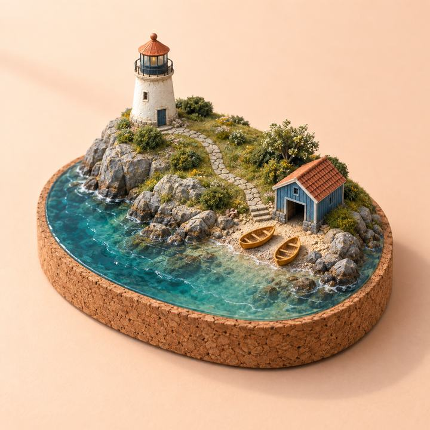
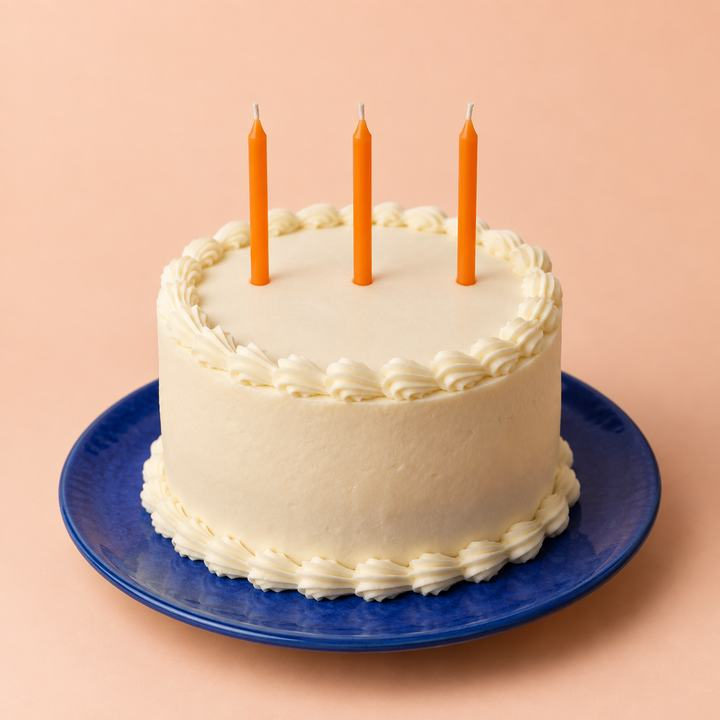

# Awesome GPT Image 2.5 Prompts — Flyne AI

<!-- BEGIN FLYNE ENTRY -->
**[Try GPT Image 2.5 · 100% Free · No Signup Required](https://flyne.ai/free-gpt-image-2-5/)**

One reference image; up to 2,000 characters. Check recipe input requirements before use. [→](docs/flyne-access.md)

106 recipes · 16 packs · 142 original PNGs. 76 bilingual EN/ZH, 18 English-only and 12 language-specific recipes. Original assets include inherited FLAQ examples; see provenance.
<!-- END FLYNE ENTRY -->

**A practical, multilingual prompt library for image generation and editing — product photos, ads, portraits, typography, UI concepts, infographics and storyboards.**

[](LICENSE)
[](prompts/README.md)
[](prompts/README.md)

**English** · [简体中文](README_zh.md) · [繁體中文](README_tw.md) · [日本語](README_ja.md) · [한국어](README_ko.md) · [Español](README_es.md) · [Français](README_fr.md) · [Deutsch](README_de.md) · [Português (Brasil)](README_pt.md) · [Italiano](README_it.md) · [Русский](README_ru.md) · [العربية](README_ar.md) · [हिन्दी](README_hi.md) · [ไทย](README_th.md) · [Bahasa Indonesia](README_id.md) · [Tiếng Việt](README_vi.md)


> Maintained by [Flyne AI](https://flyne.ai) for creators, designers and small brands. Adapted from our company’s [FLAQ open-source library](docs/upstream.md), with original credits preserved.

[Start with a prompt](#quick-start) · [Browse use cases](#prompt-library) · [View examples](#featured-examples) · [Try it free on Flyne](#try-gpt-image-25-on-flyne-ai)

## New from X: three Flyne adaptations

**P092–P094** add a bakery hero image, a paper-window travel cover and a spiral lagoon. Each has a bilingual prompt, original source link, separate generated example and a targeted next edit. Sources checked on 2026-09-21.

| Bakery campaign | Paper travel cover | Spiral lagoon |
| --- | --- | --- |
| [](prompts/16-flyne-x-discoveries.md#p092) | [](prompts/16-flyne-x-discoveries.md#p093) | [](prompts/16-flyne-x-discoveries.md#p094) |

[Copy all three prompts](prompts/16-flyne-x-discoveries.md) · [Watch creator demos](docs/x-videos.md)

## Why this prompt library exists

A useful prompt says what the image must accomplish, which details can change, and what must survive the next edit. This collection turns everyday creative jobs into concrete briefs with composition, materials, exact copy, constraints, follow-up edits and review criteria.

**106 recipes across 16 packs:** 76 recipes with complete English and Simplified Chinese prompts, 18 English-only workflow recipes, and 12 language-specific briefs. **Every recipe now has a generated example.** The 142 PNGs (138 inherited examples, a new Flyne cover and three new examples) include results, synthetic editing inputs, revision attempts and the cover. Browse the [visual gallery](docs/gallery.md) to choose a look, then open its complete prompt and review notes. Translations and follow-up edits are not counted as extra recipes.

The library is for independent brands, online shops, designers, creators, educators and small production teams. Start with a lamp campaign, repair a poster headline, preserve a pet’s distinctive features, or build a consistent illustrated story.

## Explore the new visual gallery

**106 illustrated recipes · three new Flyne adaptations · inherited editing demonstrations.** Choose a result first, then copy its prompt and use the linked inputs. Every core recipe now explains its best use, required inputs and production checks.

| Product storytelling | Character design | Cinematic storyboard |
| --- | --- | --- |
| [](prompts/15-x-community.md#p086) | [](prompts/14-sketch-to-story.md#p076) | [](prompts/14-sketch-to-story.md#p084) |
| Food typography with readable copy | One character across four materials | Identity and props across nine shots |

[**Browse all 106 illustrated recipes →**](docs/gallery.md) · [See editing inputs and review notes](docs/generation-log.md)

## What changes with Images 2.5?

The official documentation distinguishes **GPT Image 2.5 Flare** for fast everyday generation and **GPT Image 2.5 Sunburst** for workflows where editing precision matters most. Both accept text and image inputs. See the official [Flare model page](https://developers.openai.com/api/docs/models/gpt-image-2.5-flare) and [Sunburst model page](https://developers.openai.com/api/docs/models/gpt-image-2.5-sunburst).

Our practical response is to include an explicit preserve list, an approved-image workflow and a focused revision for every core recipe. These are editorial recommendations, not measured success rates. The [version notes](docs/model-notes.md) separate documented capabilities from untested assumptions.

Explore the [Image 2 vs Images 2.5 comparison](docs/images-2-vs-2-5.md) and [10 practical creative workflows](docs/playbook.md) to choose a starting point.

## Quick start

1. Pick a [recipe](prompts/README.md), then copy either its English or Chinese block. Replace the fictional product, copy and colors with your own brief.
2. For an **edit**, upload the required images in their stated order. For a **generation**, no reference is required unless you add one.
3. Review the result, save the approved image, then apply the included follow-up. In a new conversation, upload that approved version again.

Try this original quick brief:

```text
Create a landscape 3:2 product campaign for a fictional portable lamp.
Use a midnight-blue cylindrical metal base, ivory disc shade and orange pull tab.
Place the lamp on a coral stepped plinth against navy; soft, believable shadows.
Reserve the left side for exact white text: "LIGHT, UNPLUGGED." and "TIDELINE".
Show natural material texture. One lamp, no extra copy or product claims.
```

Next turn, with the approved image attached:

```text
Change only the lamp base to muted jade green. Preserve its shape and metal texture.
Keep the shade, pull tab, typography, background, camera and plinth unchanged.
```

The [full recipe](prompts/01-product.md#p001) and [exact executed prompt](assets/generation/tideline-lamp.txt) offer more detail.

## Prompt library

<!-- BEGIN PACK TABLE -->
| Collection | Recipes |
| --- | --- |
| [Product photography & e-commerce](prompts/01-product.md) | 6 |
| [Ads, social posts & creator covers](prompts/02-social.md) | 6 |
| [Portraits, fashion & pets](prompts/03-people-pets.md) | 6 |
| [Precise edits & multi-turn workflows](prompts/04-editing.md) | 6 |
| [Infographics, education & presentations](prompts/05-information.md) | 6 |
| [Brand identity & interface concepts](prompts/06-brand-ui.md) | 6 |
| [Comics, characters & game art](prompts/07-stories-games.md) | 6 |
| [Architecture, interiors & hospitality](prompts/08-spaces.md) | 6 |
| [Publishing, print & editorial illustration](prompts/09-publishing.md) | 6 |
| [Series, localization & production handoff](prompts/10-production.md) | 6 |
| [Multilingual recipes](prompts/11-multilingual.md) | 12 |
| [Launch-inspired editing examples](prompts/12-launch-examples.md) | 7 |
| [Customizable studio briefs](prompts/13-customizable-studio.md) | 6 |
| [Sketch-to-story: English workflow prompts](prompts/14-sketch-to-story.md) | 12 |
| [X community: practical visual briefs](prompts/15-x-community.md) | 6 |
| [Flyne: fresh X-inspired image briefs](prompts/16-flyne-x-discoveries.md) | 3 |
<!-- END PACK TABLE -->

## Featured examples

| Product campaign | Japanese bakery poster |
| --- | --- |
|  |  |
| [P001 · Product brief](prompts/01-product.md#p001) | [L003 · Japanese brief](prompts/11-multilingual.md#l003) |

| Wordless story | Architectural concept |
| --- | --- |
|  |  |
| [P037 · Story brief](prompts/07-stories-games.md#p037) | [P043 · Interior brief](prompts/08-spaces.md#p043) |

These images were generated for this repository using Codex’s built-in image tool. Its underlying model ID was not returned, so they are **not verified Flare or Sunburst benchmarks**. The story has a visible continuity issue in panel three; the room contains extra styling objects. Read the [honest review notes](docs/generation-log.md) before using an example as a production reference.

## New: from a Chinese walkthrough to English workflows

Twelve English recipes, **P074–P085**, cover sketch exploration, layout-guided interiors, character styles, a detailed tea editorial page, precise text edits, portrait continuity, logo and apparel concepts, and 9- or 16-panel storyboards.

Each includes input requirements, a complete English prompt, a customization suggestion, a follow-up and review criteria. Each now includes a generated demonstration using new fictional copy and scenarios, with linked editing inputs where needed. The [source-to-recipe guide](docs/sketch-to-story.md) distinguishes explicit article prompts from workflows described only in prose.

**[Copy the 12 English workflow prompts →](prompts/14-sketch-to-story.md)**

## New: customize a studio brief

Six new bilingual recipes, **P068–P073**, each include three adjustable details with defaults, alternatives and a preserve list. Use them for editorial portraits, coffee instructions, collectible packaging, handmade miniatures, greeting cards and a studio collage.

| Miniature island | Collectible packaging |
| --- | --- |
|  |  |
| [P071 · Edit one roof color](prompts/13-customizable-studio.md#p071) | [P070 · Customize colors and copy](prompts/13-customizable-studio.md#p070) |

**[Browse the six customizable recipes](prompts/13-customizable-studio.md)** · [See the real roof-color edit and source notes](docs/customizable-studio.md)

## New: seven launch-inspired before-and-after examples

Explore original adaptations of scenarios in [OpenAI’s Images 2.5 launch article](https://openai.com/index/introducing-chatgpt-images-2-5/), with bilingual recipes and 14 newly generated images.

| Before: three candles | After: five candles |
| --- | --- |
|  |  |

Try pet styling, a synthetic child’s outfit change, a duvet pattern swap, city-name replacement, cube rotation or a single-column itinerary edit. Each pair includes exact prompts and an honest review. The cube result has a geometry defect; none of these outputs is a verified model benchmark.

**[Browse all seven editing pairs →](docs/launch-examples.md)** · [Copy P061–P067](prompts/12-launch-examples.md)

## One campaign, two targeted edits

| 1 · Original | 2 · Change base color | 3 · Change headline |
| --- | --- | --- |
|  |  |  |

The second edit uses the **green output** as its input. The earlier color decision carries forward while the headline changes. Fine texture still drifts, and the stem changes with the base: this is a useful creative sequence, not a promise of pixel-perfect preservation. [Follow the complete case study](docs/editing-case-study.md).

## X community prompts with original source images

Explore six English adaptations, **P086–P091**, for ingredient lettering, fragrance storyboards, mobility posters, paper travel cards, architectural reveals and picnic announcements. Each includes a linked image from its X author, the original post, an explanation of the adaptation, customization options and a targeted follow-up.

These are third-party reference previews, **not generated results of our rewritten prompts**. Our adapted prompts now have their own newly generated examples, separately labeled and documented among the 142 original image assets. X authors’ model claims are not independent benchmarks.

**[Browse the six prompts and source images →](prompts/15-x-community.md)** · [Source and usage guide](docs/x-community.md)

## Try GPT Image 2.5 on Flyne AI

**[100% Free · No Signup Required · GPT Image 2.5 →](https://flyne.ai/free-gpt-image-2-5/)**

Create product launch images, social graphics, illustrated storyboards and mood boards. Copy a recipe, replace its fictional details, then open the free generator. For an edit, upload one reference image; pick your aspect ratio, complete verification and generate.

| Choose your workflow | Flyne entry | Start with |
| --- | --- | --- |
| Free browser generation or one-reference editing | [Free GPT Image 2.5](https://flyne.ai/free-gpt-image-2-5/) | [Product campaigns](prompts/01-product.md) |
| Model choices and advanced editing | [GPT Image 2.5 model page](https://flyne.ai/model/gpt-image-2-5/) | [Precise editing](prompts/04-editing.md) |

The free page advertises **100% Free** and **No Signup Required**. The advanced model page is a separate service and asks users to check credit cost. Recipes requiring several references need a tool that supports them. Page descriptions checked on **2026-09-21**; this is not a completed generation test.

## Get better results with fewer vague instructions

- **Name the deliverable:** a catalog photo, poster, character sheet or architectural concept.
- **Provide exact copy:** quote text; give its location and hierarchy; forbid unrequested additions.
- **Define each reference:** base scene, product, identity, material or rough layout.
- **Lock approved decisions:** list shape, text, placement, identity and lighting that should remain.
- **Edit one variable:** color first, then copy, then crop; inspect between steps.
- **Review at the destination size:** a readable full-size image may fail as a small thumbnail.

Read the [prompting guide](docs/prompting-guide.md) for structured briefs, reference roles and troubleshooting.

## Multilingual prompting

**16 README language and regional versions** help readers get started in their preferred language. English remains the default; localized entry pages include a practical prompt, usage guidance and Flyne AI resources. See the [language coverage table](docs/localization-guide.md#readme-language-coverage) for the exact scope.

The 76 bilingual recipes (73 inherited and three Flyne additions) have complete English and Simplified Chinese versions. The new [sketch-to-story pack](prompts/14-sketch-to-story.md) adds 12 English-only workflow recipes adapted from a Chinese article. The [X community pack](prompts/15-x-community.md) adds six further English adaptations with credited source images. The [multilingual pack](prompts/11-multilingual.md) adds 12 language-specific briefs, including Japanese, Korean, Spanish, French, German, Portuguese, Arabic, Hindi, Thai and Russian alongside English and Chinese.

Separate the language of your instructions from the text printed in the image. Provide approved copy, preserve brand names deliberately, and allow appropriate line wrapping. The [localization guide](docs/localization-guide.md) covers script-aware checks. Localized README pages are entry points; they do not imply that every recipe has been translated into every language.

## Originality and example records

The original FLAQ library supplied the inherited briefs and example images; Flyne AI maintains this edition and its new branded cover. See [provenance](docs/upstream.md). Each example links to its exact prompt, input relationships and review notes in the [generation log](docs/generation-log.md). All 106 recipes have illustrated examples; suggested variations and follow-ups are executed only when a separate output is recorded.

See the [originality policy](docs/originality.md) for submission standards and provenance. This independent project is not affiliated with or endorsed by OpenAI.

## FAQ

### Are these prompts free to use?

The repository’s original material is offered under the [MIT License](LICENSE). Use your own authorized inputs and review any third-party rights in your final output. Fictional demonstration names are not trademark-clearance guarantees.

### Is this an official OpenAI prompt collection?

No. This is an independent open-source project maintained by the **Flyne AI team**, based on the credited FLAQ library, without OpenAI affiliation or endorsement.

### Are all 106 prompts tested on Images 2.5?

No. We publish authored templates alongside an explicitly logged set of generated examples. The built-in generation tool did not expose its model ID. There are no claimed model comparison scores or universal success rates.

### Which API model name should I use?

Use the documented `gpt-image-2.5-flare` or `gpt-image-2.5-sunburst` identifier, rather than assuming the collection title is an API ID. The [API guide](docs/api-guide.md) contains generation and editing examples.

### Will the image contain perfect text or a usable vector logo?

Text needs proofreading. Generated logo and UI images are raster concepts; vector artwork, interactive interfaces and print-ready typography require a separate production step. Data-critical charts also need numerical validation.

### How do I contribute?

Submit an original use case with a clear brief, constraints, a follow-up and review criteria. An example image must include the exact generation prompt and accurate provenance. Follow [CONTRIBUTING.md](CONTRIBUTING.md).

## Contributing

Help expand the library with an original practical brief, a language correction or a documented image example. Include the intended use, constraints, a focused follow-up and observable review criteria. Read [CONTRIBUTING.md](CONTRIBUTING.md) before submitting.

## About Flyne AI

[Flyne AI](https://flyne.ai) offers browser-based image and video creation tools. This repository helps creators turn a concrete brief into a product visual, portrait, poster or storyboard, then refine one detail at a time.

The Flyne edition maintains the prompt catalog, visual examples, source credits and contribution workflow. [Try the free image tool](https://flyne.ai/free-gpt-image-2-5/) or explore the [advanced model page](https://flyne.ai/model/gpt-image-2-5/).

## License

[MIT](LICENSE) © 2026 Flaq AI and Flyne AI.

[Full index](prompts/README.md) · [Machine-readable prompts](data/prompts.json) · [Changelog](CHANGELOG.md) · [SEO publishing kit](docs/seo.md)
