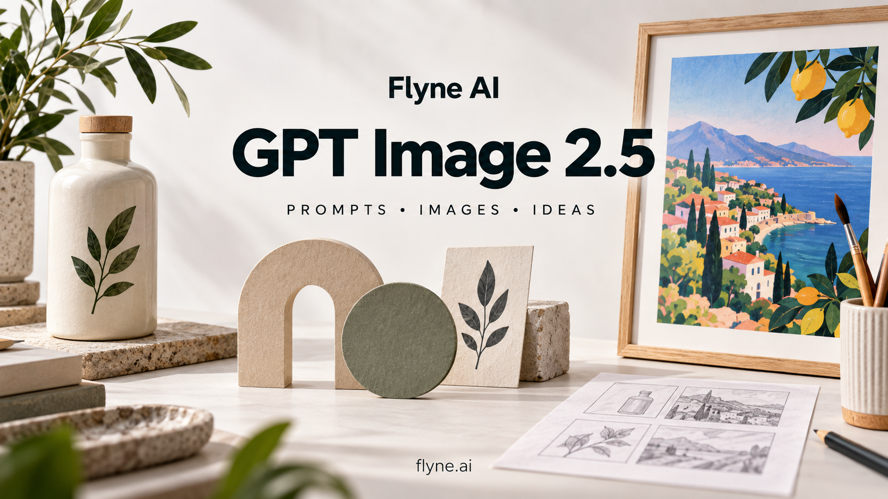

# Промпты для ChatGPT Images 2.5 — Flyne AI

Открытая версия библиотеки FLAQ, которую поддерживает Flyne AI. Сохранены сведения об авторах и исходные записи генерации. [FLAQ → Flyne](docs/upstream.md)

[English](README.md) · [简体中文](README_zh.md) · [繁體中文](README_tw.md) · [日本語](README_ja.md) · [한국어](README_ko.md) · [Español](README_es.md) · [Français](README_fr.md) · [Deutsch](README_de.md) · [Português (Brasil)](README_pt.md) · [Italiano](README_it.md) · **Русский** · [العربية](README_ar.md) · [हिन्दी](README_hi.md) · [ไทย](README_th.md) · [Bahasa Indonesia](README_id.md) · [Tiếng Việt](README_vi.md)



В библиотеке 106 рецептов в 16 разделах и 142 новых изображений. 76 основных рецептов доступны на английском и упрощённом китайском; ещё 12 рецептов подготовлены для отдельных языков. README доступен в 16 языковых и региональных версиях. Эта страница — введение на русском, а не перевод всей библиотеки. Также добавлены 18 новых рецептов рабочих процессов только на английском языке.


**[Галерея 106 рецептов с примерами](docs/gallery.md)**

## Как начать

Выберите рецепт в [каталоге](prompts/README.md). Для редактирования приложите указанные изображения и отдельно перечислите, что нужно изменить и что сохранить. Проверьте результат и используйте одобренную версию как входное изображение для следующего шага.

## Попробуйте промпт на русском

[↗ L012](prompts/11-multilingual.md#l012)

```text
Создай вертикальную афишу 2:3 для вымышленной мастерской. На кремовой бумаге покажи деревянную ложку, клубок оранжевой нити и небольшую синюю чашку. Мягкий боковой свет подчёркивает фактуру дерева и бумаги. Сверху напиши точно «СДЕЛАНО С ТЕПЛОМ», ниже «Время создавать», внизу «ОТКРЫТАЯ МАСТЕРСКАЯ». Используй тёмно-синий шрифт, широкие поля и ясную иерархию. Не заменяй кириллицу похожими латинскими буквами и не добавляй адрес или цену. В следующей правке измени только цвет нити на зелёный, сохранив текст и композицию.
```

Проверить кириллицу, отсутствие латинских подмен и правильность всех слов.

## Бесплатные ИИ-инструменты GPT Image 2.5 без регистрации

**[Flyne AI · 100% Free · No Signup Required](https://flyne.ai/free-gpt-image-2-5/)**

[GPT Image 2.5 — Flare / Sunburst](https://flyne.ai/model/gpt-image-2-5/)

[2026-09-21: Free / advanced access](docs/flyne-access.md) · [Prompts](prompts/README.md)

## Статус примеров

Для шаблона ниже изображение пока не создано. Иллюстрации проекта получены встроенным инструментом Codex, который не сообщил идентификатор модели. Это не подтверждённое сравнение Flare и Sunburst. Перед публикацией проверьте надписи, количество объектов и формы.

## О Flyne AI

Открытая версия библиотеки FLAQ, которую поддерживает Flyne AI. Сохранены сведения об авторах и исходные записи генерации.

[Flyne AI](https://flyne.ai) · [GPT Image 2.5](https://flyne.ai/model/gpt-image-2-5/)

## Материалы и участие

[106 prompts](prompts/README.md) · [Before / after](docs/launch-examples.md) · [Generation log](docs/generation-log.md) · [OpenAI API guide](docs/api-guide.md) · [Contributing](CONTRIBUTING.md)

Проект не связан с OpenAI и не одобрен OpenAI. [MIT License](LICENSE) © 2026 Flaq AI.

[X community: 6 English prompts, original posts and source image previews](prompts/15-x-community.md)

[Flyne: 3 new bilingual prompts](prompts/16-flyne-x-discoveries.md) · [3 creator video demonstrations](docs/x-videos.md)
