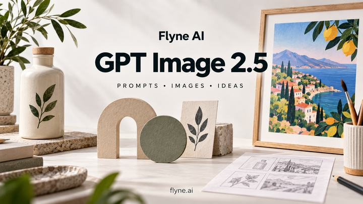

# พรอมป์ต์สำหรับ GPT Image 2.5 — Flyne AI

<!-- BEGIN FLYNE ENTRY -->
**[ใช้ GPT Image 2.5 ฟรี · ไม่ต้องสมัคร](https://flyne.ai/free-gpt-image-2-5/)**

ภาพอ้างอิงหนึ่งภาพและข้อความสูงสุด 2,000 อักขระ ตรวจสอบข้อกำหนดของแต่ละพรอมป์ต์ก่อนใช้ ฟรีและไม่ต้องสมัครเป็นข้อมูลที่เว็บไซต์ระบุ เรายังไม่ได้ยืนยันการสร้างภาพโดยไม่เข้าสู่ระบบ [→](docs/flyne-access.md)

106 พรอมป์ต์ใน 16 หมวด พร้อม PNG ต้นฉบับ 142 ภาพ รวมตัวอย่างที่สืบทอดจาก FLAQ มี 76 พรอมป์ต์ภาษาอังกฤษ/จีน 18 พรอมป์ต์ภาษาอังกฤษเท่านั้น และ 12 พรอมป์ต์เฉพาะภาษา หน้านี้เป็นบทนำ
<!-- END FLYNE ENTRY -->

ฉบับโอเพนซอร์สที่ดูแลโดย Flyne AI ดัดแปลงจากคลัง FLAQ โดยคงเครดิตผู้สร้างและบันทึกการสร้างภาพเดิมไว้ [FLAQ → Flyne](docs/upstream.md)

[English](README.md) · [简体中文](README_zh.md) · [繁體中文](README_tw.md) · [日本語](README_ja.md) · [한국어](README_ko.md) · [Español](README_es.md) · [Français](README_fr.md) · [Deutsch](README_de.md) · [Português (Brasil)](README_pt.md) · [Italiano](README_it.md) · [Русский](README_ru.md) · [العربية](README_ar.md) · [हिन्दी](README_hi.md) · **ไทย** · [Bahasa Indonesia](README_id.md) · [Tiếng Việt](README_vi.md)

[](assets/images/cover.png)


**[แกลเลอรีภาพสำหรับพรอมป์ต์ทั้ง 106 ชุด](docs/gallery.md)**

## เริ่มต้นใช้งาน

เลือกพรอมป์ต์จาก[สารบัญ](prompts/README.md) หากต้องการแก้ไขภาพ ให้แนบภาพอ้างอิงตามที่ระบุ แยกสิ่งที่ต้องเปลี่ยนออกจากสิ่งที่ต้องคงไว้ ตรวจผลลัพธ์แล้วใช้ภาพที่ผ่านการตรวจเป็นข้อมูลสำหรับการแก้ไขครั้งถัดไป

## ลองใช้พรอมป์ต์ภาษาไทย

[↗ L011](prompts/11-multilingual.md#l011)

```text
สร้างโปสเตอร์แนวตั้งอัตราส่วน 2:3 สำหรับร้านชาสมมติ ใช้พื้นหลังกระดาษสีครีม วางถ้วยเซรามิกสีน้ำเงินกับใบชาสองใบในครึ่งล่าง ให้แสงเช้าที่นุ่มนวลแสดงผิวสัมผัสของถ้วยอย่างเป็นธรรมชาติ ด้านบนเขียนตรงตามนี้ว่า “พักสักนิด” ใต้หัวเรื่องเขียน “จิบชาอย่างช้า ๆ” และด้านล่างเขียน “ร้านชาเล็ก ๆ” ใช้ตัวอักษรไทยที่อ่านง่าย เว้นระยะบรรทัดให้สระและวรรณยุกต์ไม่ชนกัน ไม่เพิ่มราคา ที่อยู่ หรือข้อความอื่น
```

ตรวจและบันทึกภาพแรก จากนั้นแนบภาพนั้นและสั่งแก้ไขต่อไปนี้แยกต่างหาก

```text
ในการแก้ไขครั้งถัดไป เปลี่ยนเฉพาะสีถ้วยเป็นสีเขียวมะกอก โดยคงข้อความและแสงเดิมไว้
```

ตรวจสระ วรรณยุกต์ ช่องว่าง และเครื่องหมาย ๆ กับผู้อ่านภาษาไทยที่คล่องแคล่ว

## เครื่องมือ AI GPT Image 2.5 ฟรี ไม่ต้องสมัครสมาชิก

**[Flyne AI · 100% Free · No Signup Required](https://flyne.ai/free-gpt-image-2-5/)**

## ฟังก์ชันขั้นสูง: ตรวจสอบค่าเครดิตก่อนสร้างภาพ

[GPT Image 2.5 — Flare / Sunburst](https://flyne.ai/model/gpt-image-2-5/)

[ฟรีและไม่ต้องสมัครเป็นข้อมูลที่เว็บไซต์ระบุ เรายังไม่ได้ยืนยันการสร้างภาพโดยไม่เข้าสู่ระบบ](docs/flyne-access.md)

## สถานะของตัวอย่าง

พรอมป์ต์ต้นฉบับมีภาพตัวอย่างแล้ว ดูภาพและบันทึกตรวจสอบที่ลิงก์ด้านล่าง ซึ่งไม่ได้ยืนยันผลของการแก้ไขทุกแบบ [L011](prompts/11-multilingual.md#l011).

ภาพสร้างด้วยเครื่องมือ Codex โดยไม่มีรหัสโมเดล จึงไม่ใช่ผลทดสอบ Flare / Sunburst ที่ยืนยันแล้ว

## เกี่ยวกับ Flyne AI

ฉบับโอเพนซอร์สที่ดูแลโดย Flyne AI ดัดแปลงจากคลัง FLAQ โดยคงเครดิตผู้สร้างและบันทึกการสร้างภาพเดิมไว้

[Flyne AI](https://flyne.ai) · [GPT Image 2.5](https://flyne.ai/model/gpt-image-2-5/)

## คู่มือและการมีส่วนร่วม

[106 prompts](prompts/README.md) · [Before / after](docs/launch-examples.md) · [Generation log](docs/generation-log.md) · [OpenAI API guide](docs/api-guide.md) · [Contributing](CONTRIBUTING.md)

โครงการนี้ไม่มีความเกี่ยวข้องกับ OpenAI และไม่ได้รับการรับรองจาก OpenAI [MIT License](LICENSE) © 2026 Flaq AI.

[X community: 6 English prompts, original posts and source image previews](prompts/15-x-community.md)

[พรอมป์ต์และวิดีโอใหม่จาก Flyne](prompts/16-flyne-x-discoveries.md) · [▶](docs/x-videos.md)

## ร่วมเป็นพันธมิตรแนะนำบริการ

Flyne AI ยินดีต้อนรับพันธมิตรแนะนำบริการเพื่อรับค่าคอมมิชชัน [ดูรายละเอียดโครงการและวิธีสมัคร](https://flyne.ai/affiliate-program/)
