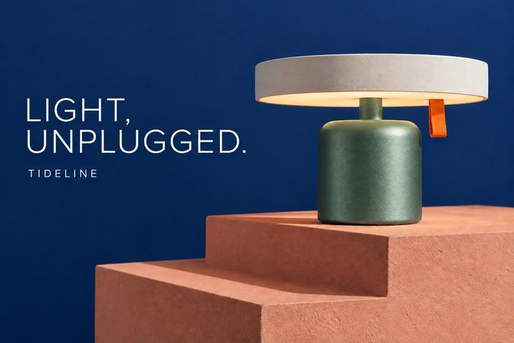

# Awesome GPT Image 2.5 Prompts — Flyne AI 提示词库

<!-- BEGIN FLYNE ENTRY -->
**[免费使用 GPT Image 2.5 · 无需注册](https://flyne.ai/free-gpt-image-2-5/)**

最多一张参考图、2,000 字符；使用前请核对配方输入要求。 [→](docs/flyne-access.md)

106 条配方 · 16 个场景包 · 142 张原始 PNG。含 76 条中英双语、18 条英文、12 条语言专用配方。图片包含继承的 FLAQ 示例，来源见生成记录。
<!-- END FLYNE ENTRY -->

**面向电商产品图、精准修图、人物宠物、广告海报、故事分镜与多语言设计的实用提示词。由 [Flyne AI](https://flyne.ai) 团队维护，基于公司 FLAQ 开源库改编，保留原始署名与生成记录。**

[English](README.md) · **简体中文** · [繁體中文](README_tw.md) · [日本語](README_ja.md) · [한국어](README_ko.md) · [Español](README_es.md) · [Français](README_fr.md) · [Deutsch](README_de.md) · [Português (Brasil)](README_pt.md) · [Italiano](README_it.md) · [Русский](README_ru.md) · [العربية](README_ar.md) · [हिन्दी](README_hi.md) · [ไทย](README_th.md) · [Bahasa Indonesia](README_id.md) · [Tiếng Việt](README_vi.md)


[直接选提示词](prompts/README.md) · [查看修图案例](docs/editing-case-study.md) · [提示词写法](docs/prompting-guide.md) · [API 使用](docs/api-guide.md) · [图片生成记录](docs/generation-log.md)

## 新增：Flyne 的 X 灵感配方

新增 **P092–P094 三条双语配方**：面包广告、纸艺旅行封面、螺旋潟湖。每条附作者原帖、改写说明、新生成配图、后续修改与检查要点，来源核对日期为 2026-09-21。

[查看新增配方](prompts/16-flyne-x-discoveries.md) · [查看演示视频](docs/x-videos.md)

## 原库案例：官方发布场景原创实践

参照 [OpenAI 发布文章](https://openai.com/index/introducing-chatgpt-images-2-5/) 的实用场景，收录原库7条中英双语配方、14张原创图片：宠物披风、虚构儿童换装、被套花色、纪念卡文字、立方体旋转、行程单栏修改与蜡烛计数。每组附输入图、编辑图、实际提示词和检查结果；立方体存在几何偏差，已如实标明。

[查看7组前后对照](docs/launch-examples.md) · [复制P061–P067提示词](prompts/12-launch-examples.md)

## 原库案例：中文文章转化的英文工作流

根据文章提取并扩展P074–P085共12条英文配方，覆盖草图、复杂英文排版、局部修图、连续编辑、品牌周边和分镜。配方、图内文案与使用指南均以英文编写，使用新虚构品牌和故事；全部保留原库生成示例，编辑类同时提供输入图和实际效果说明。

[复制12条英文提示词](prompts/14-sketch-to-story.md) · [查看来源与场景对应](docs/sketch-to-story.md)

## 原库案例：可微调创作配方

收录原库P068–P073共6条中英双语提示词，每条有3组可调整项与保留条件，覆盖工坊纪实照、手冲流程、玩具包装、灯塔微缩、纪念贺卡和陶艺拼贴。附原库7张配图，包括一次真实屋顶换色编辑。

[复制可微调提示词](prompts/13-customizable-studio.md) · [查看微调示例与来源说明](docs/customizable-studio.md)

## 从一张好看的图，到可以继续修改的作品

商业创作经常需要“产品不变，只换背景”“中文换成日文，版式不要乱”“同一角色继续下一镜”。因此，本库不止描述风格，还明确任务、构图、材质、图中文字、保留项、后续修改与验收标准。

当前版本包含 **106 条配方、16 个场景包**：76 条完整中英双语核心提示词、18条英文工作流配方，以及12条本地语言配方。翻译、追问和变体不重复计数。**全部106条现已配图**，共142张原创PNG，包含生成结果、编辑参考图、修改过程与封面。本版新增3条双语配方与3张配图，原库的来源和生成记录完整保留。可直接浏览[完整图片画廊](docs/gallery.md)。

## 新增：玩法路线与版本对比

- [10条实用玩法路线](docs/playbook.md)：从商品母版、宠物写真到故事分镜，按素材选择并逐步执行。
- [GPT Image 2 与 Images 2.5 升级对比](docs/images-2-vs-2-5.md)：解释Flare、Sunburst的区别，以及哪些能力属于改进而非首次支持。

两份指南复用现有配方和图片，不增加配方计数，不冒充模型对比实测。

README现提供 **16个语言／地区版本**，默认英文。各语言入口包含使用指引、示例提示词和平台资源；目前76条核心配方为完整中英双语，新工作流包以英文提供。[查看语言覆盖范围](docs/localization-guide.md#readme-language-coverage)。

## 三步开始

1. 从下表选择场景，复制其中一个语言版本，把虚构品牌、商品和文案替换成你的内容。
2. 新建图直接使用；编辑图按提示顺序上传素材，并说明每张图的用途。
3. 检查结果并保存确认稿，再使用条目中的后续修改。开启新对话时，请重新附上确认稿。

先试试这个原创简版：

```text
为虚构台灯品牌制作3:2横版产品广告。
台灯使用午夜蓝圆柱金属底座、象牙白圆盘灯罩和橙色拉环。
放在珊瑚色阶梯展台上，深蓝背景，阴影自然可信。
左侧仅排白字“LIGHT, UNPLUGGED.”和“TIDELINE”。
呈现真实材料纹理，只保留一盏灯，不添加其他文案或产品参数。
```

确认图片后继续：

```text
只把台灯底座改为低饱和玉绿色，保持形状和金属纹理。
灯罩、拉环、文字、背景、镜头与展台均保持不变。
```

[查看详细版](prompts/01-product.md#p001)；本库展示图的[实际执行提示词](assets/generation/tideline-lamp.txt)另有记录。

## 按实际工作选场景

<!-- BEGIN PACK TABLE -->
| 场景包 | 数量 |
| --- | --- |
| [产品摄影与电商](prompts/01-product.md) | 6 |
| [广告、社媒与创作者封面](prompts/02-social.md) | 6 |
| [人像、时尚与宠物](prompts/03-people-pets.md) | 6 |
| [精准修改与多轮工作流](prompts/04-editing.md) | 6 |
| [信息图、教育与演示](prompts/05-information.md) | 6 |
| [品牌识别与界面概念](prompts/06-brand-ui.md) | 6 |
| [漫画、角色与游戏美术](prompts/07-stories-games.md) | 6 |
| [建筑、室内与酒店空间](prompts/08-spaces.md) | 6 |
| [出版、印刷与编辑插画](prompts/09-publishing.md) | 6 |
| [系列、本地化与制作交付](prompts/10-production.md) | 6 |
| [多语言配方](prompts/11-multilingual.md) | 12 |
| [官方发布场景原创实践](prompts/12-launch-examples.md) | 7 |
| [可微调创作配方](prompts/13-customizable-studio.md) | 6 |
| [从草图到故事：英文工作流配方](prompts/14-sketch-to-story.md) | 12 |
| [X 社区实用场景](prompts/15-x-community.md) | 6 |
| [Flyne：新增 X 灵感图像配方](prompts/16-flyne-x-discoveries.md) | 3 |
<!-- END PACK TABLE -->

## 收录的图像示例

| 商品广告 | 日英双语烘焙海报 |
| --- | --- |
|  |  |
| [P001 提示词](prompts/01-product.md#p001) | [L003 提示词](prompts/11-multilingual.md#l003) |

| 修补纸月亮故事 | 社区阅读室 |
| --- | --- |
|  |  |
| [P037 提示词](prompts/07-stories-games.md#p037) | [P043 提示词](prompts/08-spaces.md#p043) |

示例来自 Codex 内置生图工具，工具未返回底层模型ID，因此**不作为 Flare / Sunburst 的指定型号实测或横向评测**。六格故事第三格提前出现缝线；阅读室增加了杯子和花瓶。这些可见偏差均在[生成记录](docs/generation-log.md)中说明。

## 同一张广告：先改颜色，再改标题

| 原稿 | 第一轮：底座换绿 | 第二轮：只换标题 |
| --- | --- | --- |
|  |  |  |

第二轮以第一轮绿色成图为输入，能直观看到确认稿如何继续修改。细微表面纹理仍有变化，灯杆也随底座变绿，不能理解为像素级不变。[查看完整过程与验收方法](docs/editing-case-study.md)。

## X 社区提示词与原图来源

新增 **P086–P091 共6条英文配方**，覆盖食材文字、香水分镜、交通工具海报、纸艺旅行卡、建筑草图演变与野餐邀请。每条都附 X 作者、原帖、原图预览、改写说明、微调参数和验收要点。

原图为第三方来源参考，不是改写提示词的生成结果，也不纳入本库 MIT 许可；本库改写后的6条X场景也已单独生成配图，计入142张原创图片资产。模型名称来自原帖作者说明，未经独立验证。

[查看提示词及来源图片](prompts/15-x-community.md) · [英文使用指南](docs/x-community.md)

## 在 Flyne AI 免费试用

**[100% Free · No Signup Required · GPT Image 2.5](https://flyne.ai/free-gpt-image-2-5/)**

复制提示词，替换产品、文字和风格后，即可尝试产品图、社交海报、插画分镜或灵感图。编辑时可上传一张参考图，选择画面比例，完成验证后生成。

- [免费生成入口](https://flyne.ai/free-gpt-image-2-5/)：页面标注“100% Free”和“No Signup Required”。
- [进阶模型入口](https://flyne.ai/model/gpt-image-2-5/)：可选择模型和设置，生成前需查看积分消耗。

以上为 2026-09-21 核对的页面说明，本次未完成平台生图实测。免费说明仅适用于免费入口。需要多张参考图的配方，须另选支持相应输入的工具。

## 针对 Images 2.5 做了哪些细化？

官方模型文档将 **Flare** 定位为快速日常生图，将 **Sunburst** 用于更重视编辑精度的工作流，均接受文字和图像输入。参见 [Flare 模型页](https://developers.openai.com/api/docs/models/gpt-image-2.5-flare)及 [Sunburst 模型页](https://developers.openai.com/api/docs/models/gpt-image-2.5-sunburst)。

本库据此强化参考图分工、保留项、多轮确认稿、局部换字和系列一致性。这是提示词设计策略，不是成功率承诺；[版本说明](docs/model-notes.md)区分官方参数与尚未验证的假设。

## 常见问题

### 可以免费使用吗？

仓库原创内容采用 [MIT](LICENSE) 开源许可。最终图片中的人物、品牌、输入素材及其他第三方权利仍需结合实际用途检查；虚构演示名称不等于经过商标检索。

### 106条都已经生成验证了吗？

全部106条已有对应生成示例，其中76条双语核心配方、18条英文工作流配方、12条本地语言配方。配图不代表所有要求均完美达成；每张图附有实际效果说明，建议中的后续修改只有单独记录结果时才表示已执行。

### 可以直接用作商业成品吗？

可作为创作起点，但需要检查文字、人物、产品外形和用途。界面图不是可运行软件；字标不是矢量文件；数据图、施工图和长篇排版需要相应制作工具复核。

### 如何避免多轮修改越改越乱？

每次只改一个变量，重复必须保留的内容，传入最近一次确认图。如有漂移，回到确认图重新修改。不要依赖新对话记住以前的图。

### 是 OpenAI 官方项目吗？

不是。这是 **Flyne AI 团队维护、基于 FLAQ 原始库改编的开源项目**，与 OpenAI 无隶属或背书关系。

## 参与贡献

欢迎提交原创场景、语言审校和带真实生成记录的图片。请阅读[贡献规范](CONTRIBUTING.md)与[原创规范](docs/originality.md)。

## 关于 Flyne AI

[Flyne AI](https://flyne.ai) 提供在线图片与视频创作工具。本库面向创作者、设计师和小品牌，整理可直接修改的产品图、海报、人物和分镜提示词。

本版本继承公司 FLAQ 开源库的 103 个案例与生成记录，新增 Flyne 品牌封面和产品入口。原始作者、X 来源和图片生成方式见[来源说明](docs/upstream.md)。

## 许可

[MIT](LICENSE) © 2026 Flaq AI 与 Flyne AI。

[默认英文首页](README.md) · [完整索引](prompts/README.md) · [机器可读数据](data/prompts.json) · [更新日志](CHANGELOG.md) · [SEO 发布文案](docs/seo.md)
