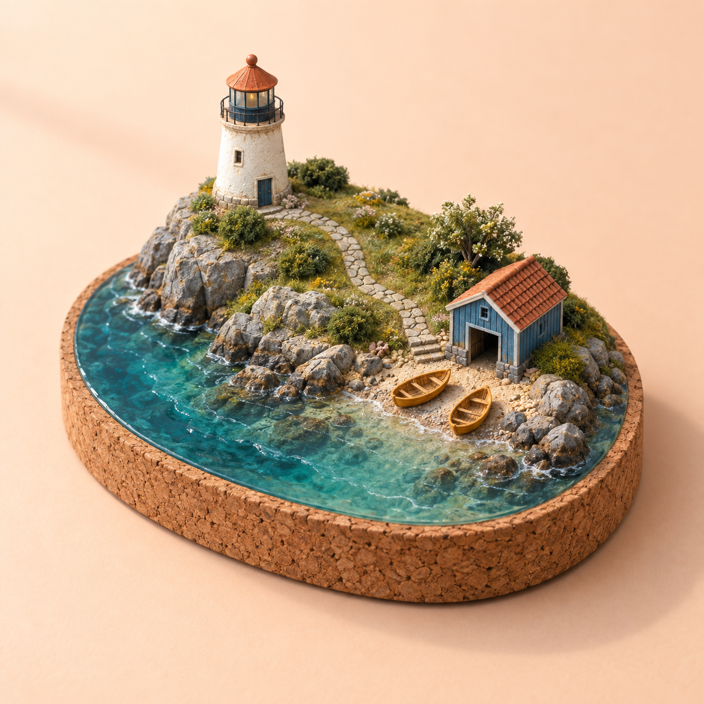
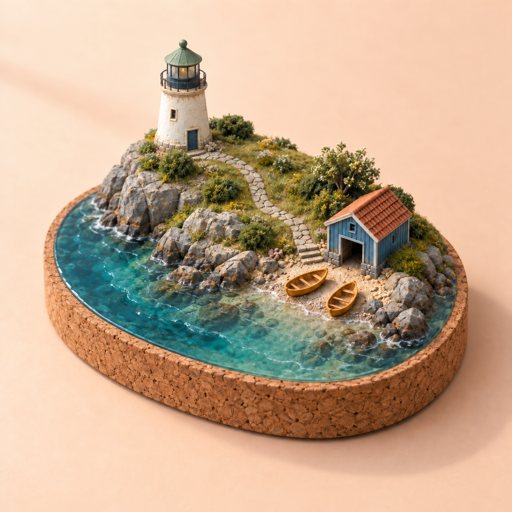

# Customizable ChatGPT Images 2.5 prompts: six studio briefs

Created by the [flaq.ai](https://flaq.ai) team. Six bilingual recipes turn a creative direction into a working prompt with three adjustable details, a preserve list and a focused next edit.

## Inspiration and authorship

We reviewed [PhiMaker5’s prompt collection](https://github.com/PhiMaker5/awesome-gpt-image-2.5-prompts) for scenario ideas. Its entries include attributed third-party prompts; a collection link does not transfer authorship of those prompts. We wrote new briefs, subjects, copy, layouts and constraints for this pack. No source images or source prompt wording were imported. These are original interpretations of broad use cases, not reproductions of the reference results.

| Reference scenario | Our independently written brief | New direction |
| --- | --- | --- |
| Natural workshop photograph, entry 1 | [P068: repair collective](../prompts/13-customizable-studio.md#p068) | Backpack repair, silver-haired craftsperson, quiet editorial copy space |
| Coffee-machine infographic, entry 2 | [P069: pour-over poster](../prompts/13-customizable-studio.md#p069) | Four visible actions instead of an internal machine diagram |
| Packaged toy, entry 18 | [P070: pocket tram](../prompts/13-customizable-studio.md#p070) | Fictional city collectible with one separately packed suitcase |
| Miniature architecture, entry 26 | [P071: lighthouse island](../prompts/13-customizable-studio.md#p071) | Original island geometry, cork base, resin sea and two boats |
| Keepsake card, entry 17 | [P072: knitted rabbit](../prompts/13-customizable-studio.md#p072) | Sewing tin, repaired ear and a message suitable beyond Christmas |
| Documentary collage, entry 20 | [P073: ceramics studio](../prompts/13-customizable-studio.md#p073) | Four process photographs with no biographical or archival claims |

## Make a prompt your own

1. **Start with the default.** Each recipe is complete and can be copied as written. No unresolved placeholders need filling.
2. **Replace one value.** Use the bilingual customization table to change a color, short text string, material or scene detail. Replace its original wording rather than adding a contradictory instruction.
3. **Choose generation or editing.** A rewritten brief generates a fresh interpretation. To retain a particular result, upload that result and use the next-edit block.
4. **Check the preserved details.** Compare count, copy, geometry, identity and framing before moving on.

These are prompt adjustments, not model fine-tuning or special API parameters. Three suggestions per recipe are not three extra recipes; unrendered suggestions are not verified outputs.

## One roof, one controlled change

| Default lighthouse roof | Edited lighthouse roof |
| --- | --- |
|  |  |

[Default generation prompt](../assets/generation/studio-lighthouse.txt) · [Exact edit prompt](../assets/generation/studio-lighthouse-edit.txt)

**Observed result:** the lighthouse roof changed to sage while the boathouse roof remained terracotta, and both boats stayed present. Shrubs, rocks and water texture also changed visibly; this is a successful targeted color change with collateral detail drift.

The edit identifies the lighthouse roof by location and explicitly preserves the boathouse roof. This matters because the input contains two similarly colored roofs.

```text
Change only the lighthouse roof at upper left, including its small finial,
from terracotta to muted sage green.
Keep the boathouse roof terracotta. Preserve both boats, all buildings,
the stone path, water, cork base, background, camera and lighting.
```

```text
只将左上方灯塔屋顶（包括顶部小圆饰）由陶土红改为柔和鼠尾草绿。
右侧船屋屋顶仍为陶土红。保留两艘船、所有建筑、石径、
水面、软木底座、背景、相机与光线。
```

This shortened teaching prompt is not the exact execution record. The separate text file above contains the actual prompt used.

## Review before publishing

- **Workshop:** inspect fingers, thread and the repair seam. A realistic style does not make a staged fictional image a real documentary record.
- **Coffee poster:** compare each label and action. This is a simplified illustration, not a complete brewing specification.
- **Toy package:** inspect the three side windows, accessory count, plastic reflections and all three text lines. Certification and manufacturing details require separate work.
- **Miniature island:** count the boats and distinguish the two roofs during editing. Keep the base inside the frame.
- **Greeting card:** check the repaired ear and verbatim copy at the intended print size.
- **Collage:** count physical prints, not only depicted scenes; confirm that each image stays inside its own border.

All seven new files were generated for this project using Codex’s built-in image tool. Its underlying model ID was not returned, so these are not verified Flare/Sunburst results. Actual observations are recorded in the [generation log](generation-log.md); the other parameter variants remain suggestions.

## 中文使用说明

本次新增P068–P073共6条中英双语配方，每条附3组可调整项：默认值、替换建议与保留项。这里的“微调”是修改提示词或基于图片做局部编辑，不是训练模型。

先用完整默认提示词生成；想保留某张图时，上传该图，再使用后续修改指令。不要同时要求多个互相冲突的颜色，也不要把“改灯塔屋顶”写成含糊的“改屋顶”，以免船屋一起变色。新语言文案应先审校，再替换图中文字。

参考仓库仅用于场景启发。新图、人物、虚构产品、排版与提示词均重新创作；每个实际生成文件保留提示词及结果检查记录。

[Browse the six recipes](../prompts/13-customizable-studio.md) · [Full index](../prompts/README.md) · [Originality policy](originality.md)
