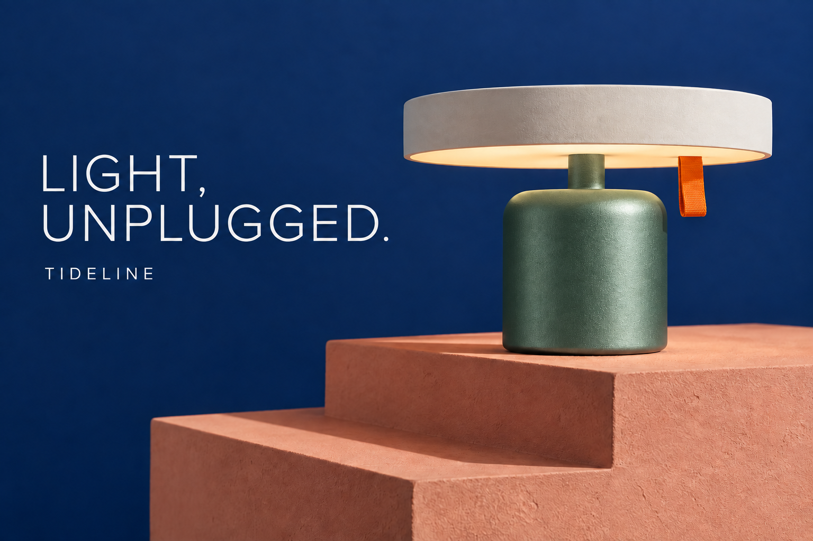

# Case study: one lamp campaign, two focused edits

The goal: change a product color, then update the headline, while carrying the accepted color into the next image. All inputs are original images generated for this repository. This is a workflow demonstration, not a controlled model comparison.

## Step 1 — Establish the campaign

The brief specifies a navy lamp, ivory shade, orange pull tab, coral plinth and two exact text strings. [Exact generation prompt](../assets/generation/tideline-lamp.txt).

Approve the silhouette, composition and copy before continuing. The generated appearance cannot prove physical claims such as recycled content or actual product specifications.

## Step 2 — Change the base color

Input: [the blue campaign](../assets/images/tideline-lamp.png). [Exact edit prompt](../assets/generation/tideline-lamp-jade.txt).

The request targets the cylindrical base and locks the shade, pull tab, typography and surroundings. The output changes the base to green and retains the main composition. The narrow stem also shifts green, slightly extending beyond the requested region. Decide whether this matters for your actual product before approval.

## Step 3 — Update the headline from the green version

Input: [the green version](../assets/images/tideline-lamp-jade.png), not the original blue campaign. [Exact edit prompt](../assets/generation/tideline-lamp-copy.txt).

The title becomes “YOUR EVENING, UPGRADED.” while “TIDELINE” remains. The product stays green. Fine surface texture, shade finish and highlights drift, so the result should not be described as preserving all non-text pixels.

## Review sheet

| Check | Observation | Consequence |
| --- | --- | --- |
| Product color carries to edit two | Yes, visibly green | Approved decisions can continue through image inputs |
| Exact new headline | Visually matches | Still proofread at intended size |
| Wordmark retained | Visually retained | Compare spelling and baseline |
| Main composition | Substantially retained | Suitable for a creative workflow demonstration |
| Locality | Stem changes with base | Strict product teams may need another edit |
| Surface detail | Visible texture/highlight drift | Not a pixel-preservation benchmark |
| Model identity | Not exposed by tool | No Flare/Sunburst attribution |

## Reuse this pattern

Name the requested region, define the change, repeat the preserve list, attach the approved source and inspect the result. If a later edit introduces drift, return to the last accepted version. For immutable typography or regulated product packaging, finish the exact text in a layout tool.

## 中文案例解读

第一轮只要求底座换绿，实际灯杆也变绿；第二轮用绿色图继续换标题，绿色保留，但表面细节有漂移。这正是为什么提示词里需要“保留项”，结果里仍需要人工验收。不要把一次视觉上成功的修改写成像素级保证。

若真实商品的灯杆必须保持蓝色，应回到第一轮输入，针对底座区域更明确地重试；不要把有偏差的确认稿层层传下去。本文记录的是实际生成结果，没有另行声称修复已完成。
