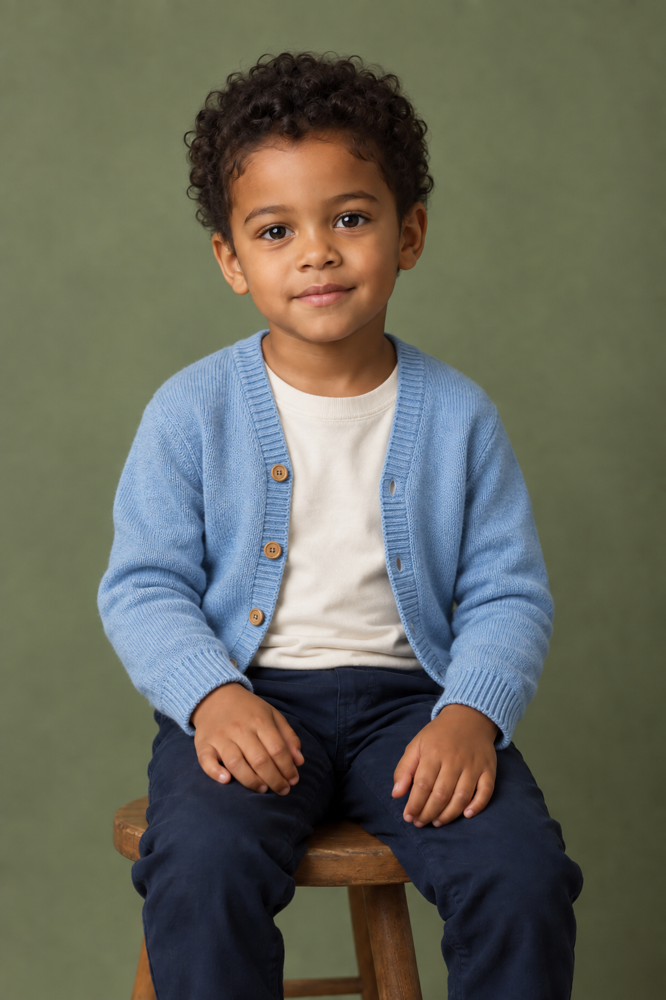
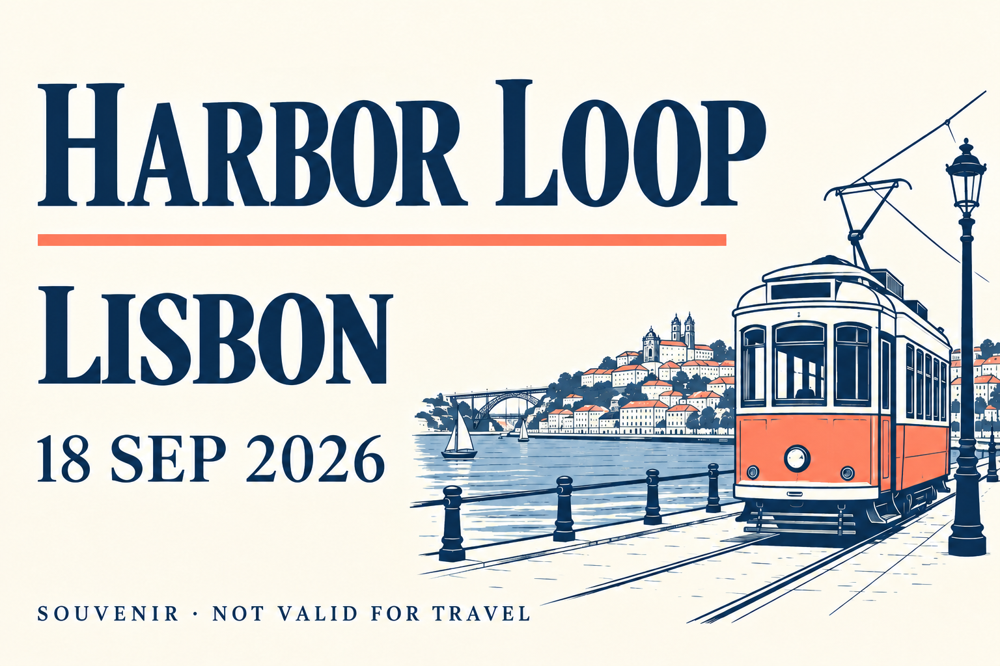
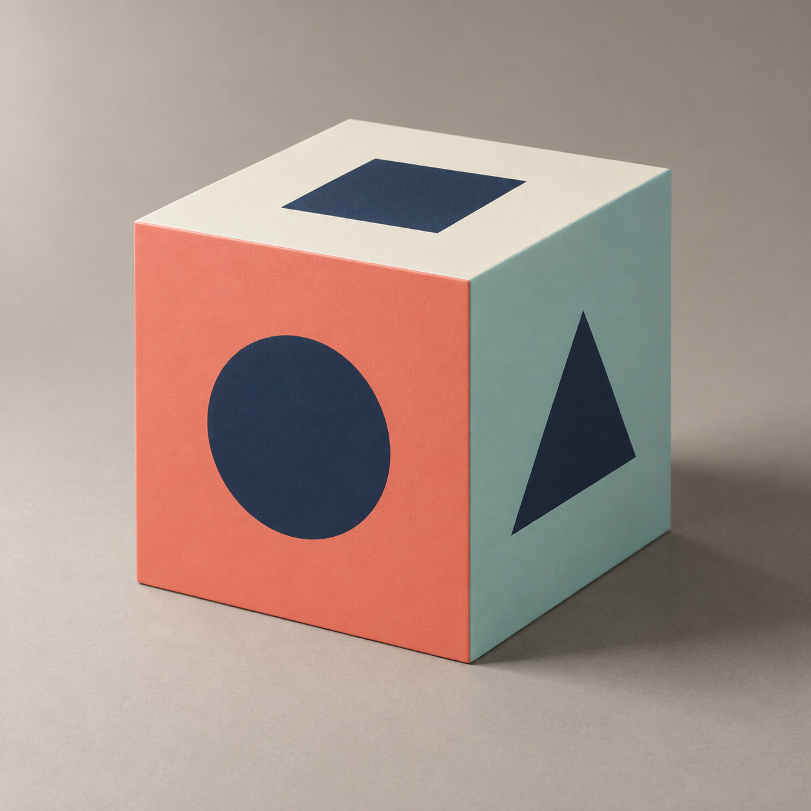
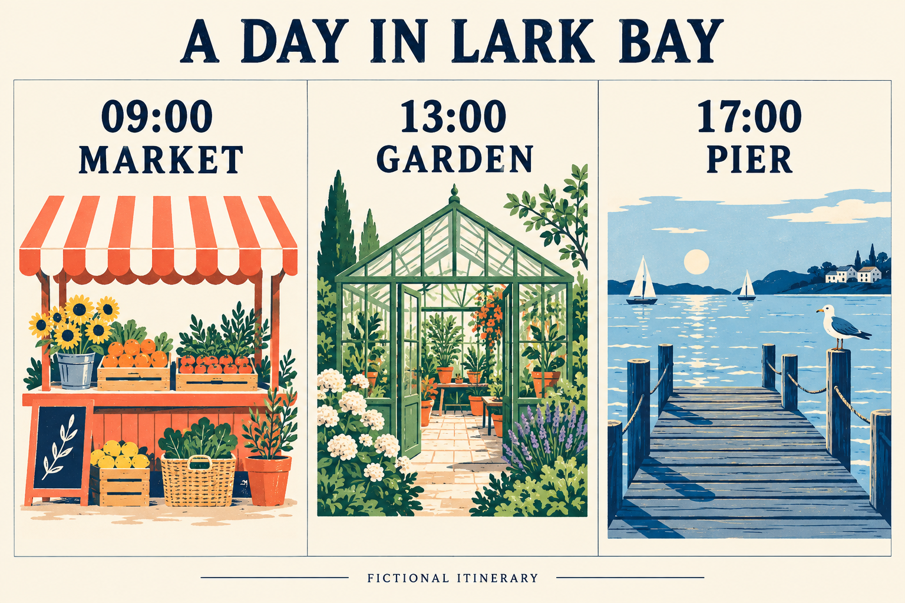

# ChatGPT Images 2.5 launch examples: original before-and-after prompts

Seven practical editing exercises by the [flaq.ai](https://flaq.ai) team, with **14 newly generated images**, English/Chinese prompts and visible review notes.

Scenario inspiration: [Introducing ChatGPT Images 2.5 — OpenAI, September 8, 2026](https://openai.com/index/introducing-chatgpt-images-2-5/). We adapted the use cases into fictional subjects and new art direction. These are our prompts, not transcriptions of the official interactive demonstrations; none of the official example images were copied or used as inputs.

七组场景均采用重新编写的提示词与本项目新生成输入图。官方文章是场景灵感来源；下方并非官方原图、原提示词或官方模型评测。

## Use an example in three steps

1. Open the input image and upload it to your image-editing conversation. To create your own starting point, use the linked input-generation prompt first.
2. Copy one language from the linked recipe. The exact executed edit prompt is also saved separately; reusable templates add framing and review instructions.
3. Compare the output against the preserve list. Only after approval, upload that result for the suggested next edit. Follow-ups in this pack have not been rendered.

The built-in image tool did not expose its model ID. These results demonstrate our workflow, not verified Images 2.5 performance or a comparison with GPT Image 2. Each pair is one edit, not evidence of long multi-turn consistency.

## Find a launch scenario

| Scenario family | Original adaptation |
| --- | --- |
| Pet styling | [P061: terrier cape](../prompts/12-launch-examples.md#p061) |
| Child portrait remix | [P062: synthetic child cardigan](../prompts/12-launch-examples.md#p062) |
| Bedding | [P063: striped duvet](../prompts/12-launch-examples.md#p063) |
| City text changes | [P064: fictional souvenir card](../prompts/12-launch-examples.md#p064) |
| Spatial rotation | [P065: marked cube, partial result](../prompts/12-launch-examples.md#p065) |
| Itinerary editing | [P066: one-column revision](../prompts/12-launch-examples.md#p066) |
| Object counting | [P067: three to five candles](../prompts/12-launch-examples.md#p067) |
| Headshot and full-body styling | Existing [P013](../prompts/03-people-pets.md#p013) and [P015](../prompts/03-people-pets.md#p015); templates, no new portrait tests |
| Multi-reference composition | Existing [P058](../prompts/10-production.md#p058) teaches reference roles for products; it does not test party-photo identity preservation |

## Seven original editing pairs

### P061 · Terrier cape makeover / 梗犬披风换装

| Original input | Edited output |
| --- | --- |
|  |  |

[English + Chinese recipe](../prompts/12-launch-examples.md#p061) · [Create the input](../assets/generation/launch-dog-input.txt) · [Exact executed edit](../assets/generation/launch-dog-edit.txt)

**Observed result:** Green cape and tie added; eye patch, ears and paws remain recognizable. Fine fur detail changes.

**检查结果：** 披风与系带已添加，眼周斑纹、耳朵和爪子仍可识别，细部毛发有变化。

**Next experiment, not yet rendered:** Change only the cape fabric to burgundy. Keep the tie ochre and preserve the dog.

### P062 · Synthetic child portrait wardrobe edit / 虚构儿童人像换装

| Original input | Edited output |
| --- | --- |
|  |  |

[English + Chinese recipe](../prompts/12-launch-examples.md#p062) · [Create the input](../assets/generation/launch-child-input.txt) · [Exact executed edit](../assets/generation/launch-child-edit.txt)

**Observed result:** Cardigan and cream shirt appear as requested; face, hands and pose remain visually similar. Fine texture is not identical. Subject is fully synthetic.

**检查结果：** 开衫和内搭符合要求，脸部、手部及姿势大体保持；细节并非像素一致。人物完全虚构。

**Next experiment, not yet rendered:** Change only the cardigan buttons to cream. Preserve the approved outfit and portrait.

### P063 · Duvet pattern swap / 卧室被套花色替换

| Original input | Edited output |
| --- | --- |
|  |  |

[English + Chinese recipe](../prompts/12-launch-examples.md#p063) · [Create the input](../assets/generation/launch-bed-input.txt) · [Exact executed edit](../assets/generation/launch-bed-edit.txt)

**Observed result:** Striped duvet and two oatmeal pillows are present; room arrangement remains similar. Duvet folds drift slightly.

**检查结果：** 条纹被套与两只原色枕头符合要求，房间布局大体保留，被子褶皱略有变化。

**Next experiment, not yet rendered:** Change only the stripe color from teal to rust; preserve stripe spacing and the pillows.

### P064 · Souvenir city-name replacement / 纪念卡城市文字替换

| Original input | Edited output |
| --- | --- |
|  |  |

[English + Chinese recipe](../prompts/12-launch-examples.md#p064) · [Create the input](../assets/generation/launch-ticket-input.txt) · [Exact executed edit](../assets/generation/launch-ticket-edit.txt)

**Observed result:** LISBON and the other required strings visually match. Illustration details drift slightly. This is a fictional souvenir, not a valid ticket.

**检查结果：** LISBON 与其他指定文字目测符合要求，插画细节略有变化；这是虚构纪念卡，不是有效车票。

**Next experiment, not yet rendered:** Replace only LISBON with KYOTO. Keep all other wording and illustration unchanged.

### P065 · Symbol-marked cube rotation / 带符号立方体旋转

| Original input | Edited output |
| --- | --- |
|  |  |

[English + Chinese recipe](../prompts/12-launch-examples.md#p065) · [Create the input](../assets/generation/launch-cube-input.txt) · [Exact executed edit](../assets/generation/launch-cube-edit.txt)

**Observed result:** Partial result: face identities follow the intended arrangement, but a rigid 90-degree rotation is not established. The top outline has a visible kink. Do not use as validated geometry.

**检查结果：** 部分达成：符号与颜色的对应关系符合目标，但未验证严格90度刚体旋转，顶部轮廓有明显折点，不可作为精确几何示例。

**Next experiment, not yet rendered:** Repair only the bent top outline into straight cube edges. Preserve each face color and symbol; verify perspective again.

### P066 · One-column itinerary revision / 旅行信息图单栏修改

| Original input | Edited output |
| --- | --- |
|  |  |

[English + Chinese recipe](../prompts/12-launch-examples.md#p066) · [Create the input](../assets/generation/launch-travel-input.txt) · [Exact executed edit](../assets/generation/launch-travel-edit.txt)

**Observed result:** Middle time and heading match; three bowls appear on the workbench. Extra vessels appear on the shelf. Outer columns remain recognizable but fine illustration details drift.

**检查结果：** 中栏时间与标题正确，工作台上有三个碗；搁板新增其他器皿。左右栏保留主要内容，但插画细节有漂移。

**Next experiment, not yet rendered:** Change only STUDIO to POTTERY. Preserve 14:00, all three bowls and both outer columns.

### P067 · Birthday candle count edit / 生日蜡烛数量修改

| Original input | Edited output |
| --- | --- |
|  |  |

[English + Chinese recipe](../prompts/12-launch-examples.md#p067) · [Create the input](../assets/generation/launch-cake-input.txt) · [Exact executed edit](../assets/generation/launch-cake-edit.txt)

**Observed result:** Exactly five unlit orange candles are visible. Cake, plate and composition are similar; frosting texture changes slightly.

**检查结果：** 可清楚数出五根未点燃橙色蜡烛，蛋糕、盘子和构图大体保持，奶油纹理稍有变化。

**Next experiment, not yet rendered:** Light only the center candle. Keep exactly five candles and leave the other four unlit.

## More ways to use the launch ideas

The announcement also introduces Sketch, format templates, image comments and prompt sharing in ChatGPT. These are product interfaces, not parameter names to add to an API request. [Official overview](https://openai.com/index/introducing-chatgpt-images-2-5/).

Our suggested workflows:

- **Sketch a room:** draw the window, sofa and walking route; attach the sketch to [P044](../prompts/08-spaces.md#p044), explicitly separating fixed geometry from styling freedom.
- **Sketch an outfit:** mark the silhouette and hem, then adapt [P015](../prompts/03-people-pets.md#p015). Treat the sketch as garment shape, and a separate photo as identity reference.
- **Start from a format template:** fill in audience, approved copy, hierarchy and output ratio before trying [P007](../prompts/02-social.md#p007). Check text at the actual publishing size.
- **Make a regional correction:** select or comment on the intended region, name one change and list surrounding elements to preserve. The bed and souvenir-card pairs above are useful exercises.
- **Share a reusable idea:** remove personal details and include reference roles, exact image text, an example and its limitations. Keep the exact execution record distinct from the reusable brief.
- **Try a retro portrait:** adapt [P013](../prompts/03-people-pets.md#p013) with a muted lilac studio backdrop, soft direct flash and a textured knit sweater; keep facial proportions and age. This is an unrendered styling suggestion.
- **Plan a group composite:** identify each authorized person reference, write a left-to-right seating plan, and specify shared camera height and light. Check that no face is duplicated or blended. This is an unrendered workflow, not a completed party-photo example.

For precise cube angles, compare with a 3D reference or render. For candle counts, count visible objects manually. For itinerary copy, compare each requested string; this fictional card does not validate real opening hours or routes.

[All recipes](../prompts/README.md) · [Full generation records](generation-log.md) · [Model comparison and limits](images-2-vs-2-5.md)
