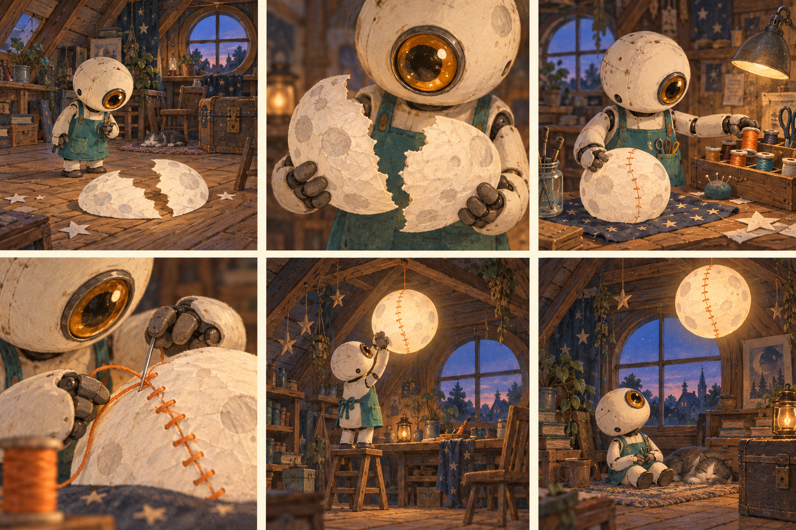

# ChatGPT Images 2.5 玩法推荐：从一张图到一组作品

由 [flaq.ai](https://flaq.ai) 团队整理。这里把现有103条提示词串成可操作的创作路线：准备素材、选配方、检查结果，再继续下一步。路线组合不重复计入配方数量，也不代表这些玩法是2.5独占功能。

第一次使用建议从“商品换色”或“海报换字”开始：目标小、结果易比较。模型选择和已核实升级说明见 [Image 2与2.5对比](images-2-vs-2-5.md)。

## 按手头素材选择

| 你有的素材 | 推荐玩法 | 可能得到的作品 | 起点 |
| --- | --- | --- | --- |
| 一张商品照 | 电商图到配色系列 | 主图、材质特写、换色版 | [P002](../prompts/01-product.md#p002)、[P019](../prompts/04-editing.md#p019) |
| 一张确认海报 | 文案试版与多语言本地化 | 不同标题或语言版本 | [P022](../prompts/04-editing.md#p022)、[P057](../prompts/10-production.md#p057) |
| 一张宠物照 | 宠物主题写真与水彩纪念 | 探险照、插画礼物 | [P014](../prompts/03-people-pets.md#p014)、[P018](../prompts/03-people-pets.md#p018) |
| 一张获同意的人像 | 职业头像与虚拟穿搭 | 自然头像、服装搭配预览 | [P013](../prompts/03-people-pets.md#p013)、[P015](../prompts/03-people-pets.md#p015) |
| 一张房间照 | 小成本软装提案 | 墙面、柜门或灯光变体 | [P044](../prompts/08-spaces.md#p044)、[P021](../prompts/04-editing.md#p021) |
| 一张草图 | 草图转空间效果 | 亭子、局部花盆方案 | [P048](../prompts/08-spaces.md#p048)、[P023](../prompts/04-editing.md#p023) |
| 一个故事想法 | 角色表到连续分镜 | 六格漫画、单镜头视觉 | [P038](../prompts/07-stories-games.md#p038)、[P037](../prompts/07-stories-games.md#p037) |
| 已确认的知识或数据 | 教学卡与演示图 | 信息图、流程页 | [P025](../prompts/05-information.md#p025)、[P030](../prompts/05-information.md#p030) |
| 一套品牌视觉 | 包装和多尺寸广告 | 包装家族、竖版宣传图 | [P035](../prompts/06-brand-ui.md#p035)、[P056](../prompts/10-production.md#p056) |
| 暂时没有图片 | 原创产品或编辑封面 | 初始视觉方向 | [P001](../prompts/01-product.md#p001)、[P049](../prompts/09-publishing.md#p049) |

## 玩法1：把商品广告变成可修改的母版

**适合：** 小品牌、电商、众筹视觉。先用[P001](../prompts/01-product.md#p001)生成基础广告，或上传自己的商品照。

1. 先确定外形、标签、光线、构图，保存母版。
2. 用[P019](../prompts/04-editing.md#p019)只改一个颜色区域。
3. 再以换色确认图修改标题。
4. 最后按[P056](../prompts/10-production.md#p056)调整画幅，检查平台遮罩。

**验收重点：** 标签、拉环、边缘、投影、产品比例。把“只改底座”具体到区域，不要让灯杆和背景也被重新解释。

这两张是本库已有真实生成结果。[完整记录](editing-case-study.md)还展示了第一轮换色和局限。

## 玩法2：一张海报做跨语言宣传

**适合：** 餐饮、小店活动、国际社媒。先锁定一套版式，再准备每种语言的准确文字。

使用[P022](../prompts/04-editing.md#p022)做定点替换，参考[P057](../prompts/10-production.md#p057)处理本地化。需要从零生成时，选[12种语言简报](../prompts/11-multilingual.md)。每个语言版本独立生成，别在一个请求里混放多个互相冲突的标题。

**验收重点：** 字符、品牌是否保留、文字框是否溢出、标点与阅读方向。允许文本框内重排，不允许擅自翻译品牌名或发明活动信息。

此图对应[L003](../prompts/11-multilingual.md#l003)，并不证明其他语言模板已实测。详见[语言审校表](localization-guide.md)。

## 玩法3：保留宠物特征的主题写真

**准备：** 清楚展示眼睛、耳朵、脸部斑纹的自有照片。用[P014](../prompts/03-people-pets.md#p014)改场景，先保持自然姿态；再单独修改围巾颜色。喜欢绘画效果可另用[P018](../prompts/03-people-pets.md#p018)。

**验收重点：** 特征斑块有没有换边、耳朵是否被对称化、口鼻是否变形。若一边换场景一边改物种、姿势和画风，辨识度更难检查。两个方向都从原参考图出发，避免写真误差被带进水彩版。

## 玩法4：一张头像，尝试不同服装与背景

先用[P013](../prompts/03-people-pets.md#p013)建立自然头像方向；试穿时按[P015](../prompts/03-people-pets.md#p015)提供第二张服装图。分别说明“图1锁定人物，图2只提供衣服”。

**验收重点：** 五官、肤色、体型、手部及领口遮挡。头像方向与全身试穿应选合适构图的输入图，不应从胸像推断准确全身比例。虚拟试穿可预览搭配，不能代替真实尺码与合身测试。

## 玩法5：给房间做软装候选方案

用[P044](../prompts/08-spaces.md#p044)改变墙面或柜门材质，再以确认稿做[P021](../prompts/04-editing.md#p021)傍晚光照版。一次不要同时移动墙、改窗、换家具、加灯具。

**验收重点：** 原窗角、门洞、地面接缝、家具尺度。看起来更宽敞可能是模型改变了空间；把原照和新图并排比较。无原照时可从[P043](../prompts/08-spaces.md#p043)做原创阅读室概念。

此图为原创生成，并非真实房间改造前后对照。建筑尺寸和可施工性未经验证。

## 玩法6：从手绘位置到真实材质

草图适合表达“放在哪里”“大致多大”。在[P023](../prompts/04-editing.md#p023)中，照片提供真实环境，草图只提供花盆位置；[P048](../prompts/08-spaces.md#p048)则把原创亭子草图变成材质概念。

**验收重点：** 原轮廓和支撑数、透视、接触阴影。明确草图线条不保留在成图里。无需依赖某个特定界面按钮；只要能上传草图，就可以表达同样的参考角色。

## 玩法7：让原创角色演完一个小故事

先用[P038](../prompts/07-stories-games.md#p038)确认角色，再把角色参考附给[P037](../prompts/07-stories-games.md#p037)的分镜任务。固定一个短故事，每格一个动作。最后可用[P060](../prompts/10-production.md#p060)扩展选中镜头。

**验收重点：** 衣服和配饰、道具损坏状态、时间顺序、镜头间空间关系。故事里“尚未完成”的状态也要说清楚。

已有示例第三格提前出现缝线，是具体的验收反例。不要因为画面精致就忽略叙事错误；本页没有把建议的修正描述成已执行。

## 玩法8：把知识变成可讲解的视觉

先确定正文和关系，再选[P025](../prompts/05-information.md#p025)科普或[P030](../prompts/05-information.md#p030)流程图。只让图像承担表达任务，不让它同时编数据、判断事实与排版。

**验收重点：** 箭头方向、标签对应、步骤数。若做[P027](../prompts/05-information.md#p027)数据图，核对实际比例；最终严肃数据出版用图表软件重建。插画表现漂亮不能证明科学结论正确。

## 玩法9：为小品牌建立一套视觉语言

先确认[P031](../prompts/06-brand-ui.md#p031)字标概念，再将品牌文字、配色和留白规则带入[P035](../prompts/06-brand-ui.md#p035)包装系列。把参考图职责写清：参考字形与配色，不借用不相关的产品形状。

**验收重点：** 字形、标签基线、包装尺寸关系。生成图是方向探索；真正上线的字标需矢量重建，包装还要按刀模、印刷和信息规范制作。

## 玩法10：旧照片修复，再考虑风格化

以[P059](../prompts/10-production.md#p059)先修明确划痕、尘点，保留颗粒与旧色调。把修复稿单独保存；如要做插画礼物，另存一个艺术版本，不把它混称为忠实复原。

**验收重点：** 人物脸部是否被补成另一个人、衣纹是否被重画。看不清的历史细节应保持不确定，而不是把模型补出的部分当作真实记录。

## 每次修改都做一次简短检查

| 检查项 | 可接受标准 |
| --- | --- |
| 本轮目标 | 指定变化已完成 |
| 主体 | 重要轮廓、身份或标签仍一致 |
| 文字 | 准确、可读，没有旧字残留 |
| 上一轮决定 | 没有被后续编辑覆盖 |
| 未修改区域 | 没有影响用途的漂移 |
| 实际用途 | 在目标尺寸、裁切和背景下仍可用 |

失败时退回最近确认稿，缩小修改范围再试。这些路线复用现有配方，未增加虚构测试数量。

## English overview

This playbook connects existing recipes into ten practical workflows: product variants, multilingual posters, pet portraits, headshots and styling, room refreshes, sketch-led visualization, character stories, educational visuals, brand families and photo restoration. Start from a suitable reference, approve one result, then change one variable. Inspect identity, geometry, text and earlier decisions after every edit.

The embedded images are existing repository examples, not newly run model comparisons. All linked recipes now have generated examples and observed review notes; optional follow-up suggestions are separate steps. Read the [model comparison](images-2-vs-2-5.md) and [generation log](generation-log.md) for the evidence boundaries.

## 来源说明

本次提供的微信文章仍返回验证页，无法核对其正文；以上路线由flaq.ai团队根据现有原创库重新组织，不宣称来自该文章。获得文章正文后，才能逐项补充文章特有玩法并处理相应来源说明。
