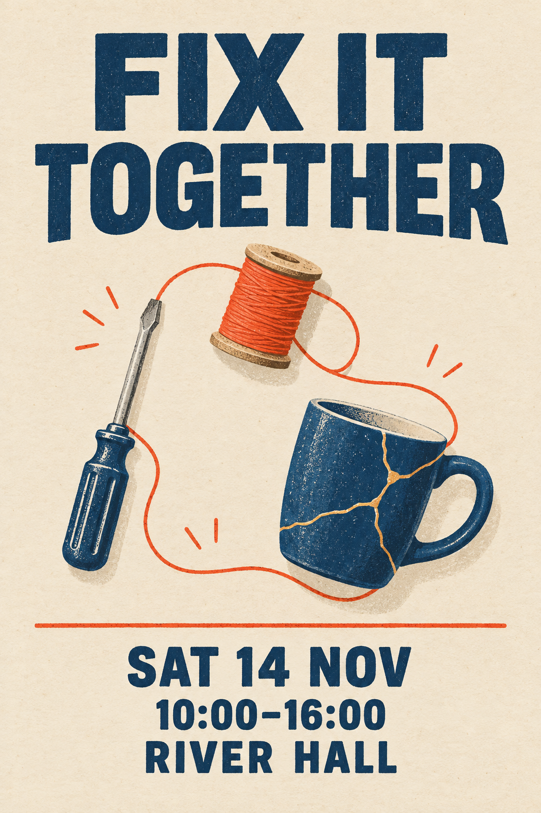
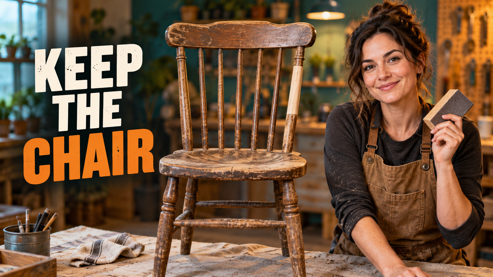
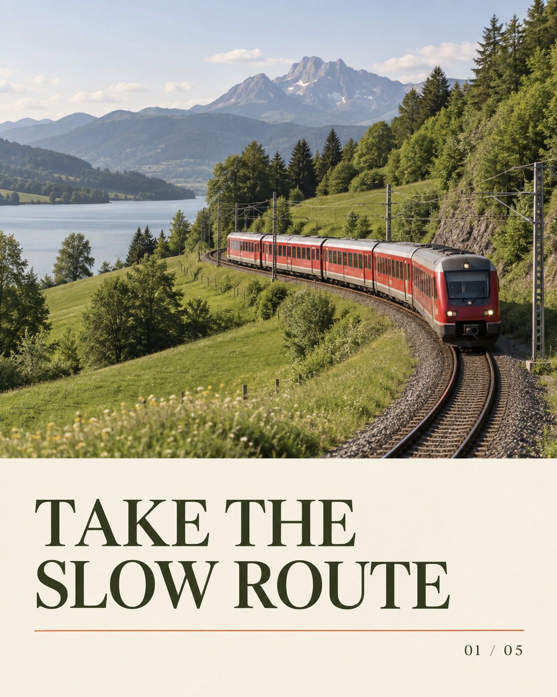

# Ads, social posts & creator covers · 广告、社媒与创作者封面

[All recipes / 全部配方](README.md)

Images 2.5 workflow focus: **Clear hierarchy / 信息层级**.

Copy one language block. For edits, attach the images named in the prompt in that order. Requested ratios are creative targets; verify actual output dimensions.

任选一种语言复制。编辑任务须按提示顺序附参考图；比例为创作目标，输出后核对实际尺寸。

- [P007 · Repair café event poster](#p007)
- [P008 · Creator thumbnail with one idea](#p008)
- [P009 · Carousel cover for slow travel](#p009)
- [P010 · Neighborhood lunch special](#p010)
- [P011 · Podcast editorial cover](#p011)
- [P012 · Seasonal market campaign](#p012)

<a id="p007"></a>
## P007 · Repair café event poster / 社区修理日海报

**Mode:** generate · **Target:** 2:3 · **Author:** FLAQ team (original); Flyne AI edition

**Best for:** Social posts, event announcements and editorial covers.

**Inputs:** No reference upload is required for this default text-to-image prompt.

**Production check:** Check the headline at phone size and keep essential copy away from crop edges. Use the target ratio as a framing request; inspect actual pixel dimensions before export.

**Generated example / 已生成示例：** Exact executed prompts and review notes are in the [generation log](../docs/generation-log.md). These examples do not verify every template variation.



[Repair café event poster — generated example: exact prompt / 实际提示词](../assets/generation/example-p007.txt)

**Observed review:** Headline, date, time and venue are readable; repaired mug and tools form a coherent print illustration.

### English

```text
Asset: Repair café event poster. Target aspect ratio: 2:3. Mode: generate.
Create a community poster on recycled cream paper. An overhead arrangement of a small screwdriver, orange thread spool and repaired blue mug forms a loose circle. Large ink-blue headline "FIX IT TOGETHER" sits above; below use "SAT 14 NOV", "10:00–16:00", "RIVER HALL". A bright vermilion line ties the typography together. Flat print artwork with generous margins.
Constraints: Fictional event; no QR code, sponsors, prices or unprovided details.
Render only explicitly requested image text. Do not add unrelated logos, signatures or captions.
```

### 简体中文

```text
交付物：社区修理日海报。目标比例：2:3。模式：新建。
制作社区修理日海报，奶油再生纸质感。小螺丝刀、橙色线轴、修好的蓝杯俯拍围成松散圆环。深蓝大标题“FIX IT TOGETHER”，下方“SAT 14 NOV”“10:00–16:00”“RIVER HALL”，朱红细线串联排版，平面印刷稿并保留宽边距。
约束：活动为虚构示例，不添加二维码、赞助商、价格或未提供信息。
只渲染明确要求的图中文字，不添加无关标识、签名或说明。
```

### Next edit / 后续修改

```text
Replace only the date with "SAT 21 NOV"; preserve hierarchy and line breaks.
```

```text
仅将日期换成“SAT 21 NOV”，保持层级与换行。
```

**Review / 验收：** Check date, time dash and readability at phone-screen size. 检查日期、时间连接号及手机尺寸可读性。

[Back to index / 返回索引](README.md)


<a id="p008"></a>
## P008 · Creator thumbnail with one idea / 单一主题视频缩略图

**Mode:** generate · **Target:** 16:9 · **Author:** FLAQ team (original); Flyne AI edition

**Best for:** Social posts, event announcements and editorial covers.

**Inputs:** No reference upload is required for this default text-to-image prompt.

**Production check:** Check the headline at phone size and keep essential copy away from crop edges. Use the target ratio as a framing request; inspect actual pixel dimensions before export.

**Generated example / 已生成示例：** Exact executed prompts and review notes are in the [generation log](../docs/generation-log.md). These examples do not verify every template variation.



[Creator thumbnail with one idea — generated example: exact prompt / 实际提示词](../assets/generation/example-p008.txt)

**Observed review:** Headline and sanding block are clear with the chair centered. The restored section is subtle rather than a sharply demarcated before/after.

### English

```text
Asset: Creator thumbnail with one idea. Target aspect ratio: 16:9. Mode: generate.
Make a crisp editorial thumbnail for a video about restoring a thrift-store chair. Show a fictional adult craftsperson at right holding a sanding block; center an old timber chair with a small repaired section. At left place large exact text "KEEP THE CHAIR". Warm workshop background softly defocused, teal and orange accents, strong separation and one clear focal point.
Constraints: No celebrity likeness, fake reactions, arrows or unverified before-and-after claim.
Render only explicitly requested image text. Do not add unrelated logos, signatures or captions.
```

### 简体中文

```text
交付物：单一主题视频缩略图。目标比例：16:9。模式：新建。
制作修复旧椅视频封面。右侧虚构成年手作者手持打磨块，中间旧木椅显示一小块修复区域，左侧大字“KEEP THE CHAIR”。温暖工作室背景轻微虚化，青绿和橙色点缀，主体分离清楚，仅一个视觉重点。
约束：不使用名人面孔、夸张假表情、箭头或未经证明的前后效果。
只渲染明确要求的图中文字，不添加无关标识、签名或说明。
```

### Next edit / 后续修改

```text
Enlarge only the title by 15%, leaving its left margin and subject position unchanged.
```

```text
仅放大标题15%，保留左边距和人物位置。
```

**Review / 验收：** Review hands, chair legs and title legibility at 320px wide. 检查手部、椅腿及320像素宽下的标题可读性。

[Back to index / 返回索引](README.md)


<a id="p009"></a>
## P009 · Carousel cover for slow travel / 慢旅行轮播封面

**Mode:** generate · **Target:** 4:5 · **Author:** FLAQ team (original); Flyne AI edition

**Best for:** Social posts, event announcements and editorial covers.

**Inputs:** No reference upload is required for this default text-to-image prompt.

**Production check:** Check the headline at phone size and keep essential copy away from crop edges. Use the target ratio as a framing request; inspect actual pixel dimensions before export.

**Generated example / 已生成示例：** Exact executed prompts and review notes are in the [generation log](../docs/generation-log.md). These examples do not verify every template variation.



[Carousel cover for slow travel — generated example: exact prompt / 实际提示词](../assets/generation/example-p009.txt)

**Observed review:** Headline and slide number are legible; the red train follows a coherent curve through the landscape.

### English

```text
Asset: Carousel cover for slow travel. Target aspect ratio: 4:5. Mode: generate.
Design the cover of a travel carousel with a quiet photograph of a red regional train curving through green hills. Place a cream panel in the lower third with "TAKE THE SLOW ROUTE" and small "01 / 05". Use a dark olive serif headline and fine orange rule. Keep train architecture plausible and landscape uncluttered.
Constraints: Illustrative destination, no invented route names, schedules or prices.
Render only explicitly requested image text. Do not add unrelated logos, signatures or captions.
```

### 简体中文

```text
交付物：慢旅行轮播封面。目标比例：4:5。模式：新建。
设计旅行轮播封面：红色地方列车穿过绿色山丘，画面安静。下方三分之一奶油色文字板写“TAKE THE SLOW ROUTE”和小字“01 / 05”，深橄榄衬线标题、橙色细线，列车结构可信，风景简洁。
约束：为示意目的地，不编造线路名、时刻表和价格。
只渲染明确要求的图中文字，不添加无关标识、签名或说明。
```

### Next edit / 后续修改

```text
Make a second cover by changing only the title to "PACK A LITTLE LESS" and page marker to "02 / 05".
```

```text
仅将标题改为“PACK A LITTLE LESS”，页码改为“02 / 05”，制作第二张封面变体。
```

**Review / 验收：** Check train windows, exact page marker and consistent text baseline. 检查列车窗户、页码及文字基线一致性。

[Back to index / 返回索引](README.md)


<a id="p010"></a>
## P010 · Neighborhood lunch special / 街区餐厅午餐海报

**Mode:** generate · **Target:** 4:5 · **Author:** FLAQ team (original); Flyne AI edition

**Best for:** Social posts, event announcements and editorial covers.

**Inputs:** No reference upload is required for this default text-to-image prompt.

**Production check:** Check the headline at phone size and keep essential copy away from crop edges. Use the target ratio as a framing request; inspect actual pixel dimensions before export.

**Generated example / 已生成示例：** Exact executed prompts and review notes are in the [generation log](../docs/generation-log.md). These examples do not verify every template variation.


[Neighborhood lunch special — generated example: exact prompt / 实际提示词](../assets/generation/example-p010.txt)

**Observed review:** Both copy lines are readable and the bowl ingredients are identifiable. Additional background foliage and cutlery appear, so the result is less minimal than the brief.

### English

```text
Asset: Neighborhood lunch special. Target aspect ratio: 4:5. Mode: generate.
Photograph a roast squash bowl with chickpeas, rice and herb dressing from a low three-quarter angle on a brushed steel café table. Use honest serving proportions and daylight, not excessive steam. Above the bowl place exact dark-green text "A GOOD LUNCH"; below "ROAST SQUASH BOWL". A small coral square balances a cream background.
Constraints: No nutritional values, dietary certification or fabricated discount.
Render only explicitly requested image text. Do not add unrelated logos, signatures or captions.
```

### 简体中文

```text
交付物：街区餐厅午餐海报。目标比例：4:5。模式：新建。
四分之三低角度拍摄烤南瓜碗，包含鹰嘴豆、米饭、香草酱，放在拉丝钢咖啡桌上。份量真实，自然日光，不夸张添加蒸汽。上方深绿标题“A GOOD LUNCH”，下方“ROAST SQUASH BOWL”，奶油背景用珊瑚小方块平衡。
约束：不添加营养数值、饮食认证或虚构折扣。
只渲染明确要求的图中文字，不添加无关标识、签名或说明。
```

### Next edit / 后续修改

```text
Change only the coral square to cobalt blue; keep food and text unchanged.
```

```text
只将珊瑚方块换为钴蓝，保留食物与文字。
```

**Review / 验收：** Inspect recognizable ingredients, bowl rim and headline spacing. 检查食材辨识度、碗沿和标题字距。

[Back to index / 返回索引](README.md)


<a id="p011"></a>
## P011 · Podcast editorial cover / 播客编辑风封面

**Mode:** generate · **Target:** 1:1 · **Author:** FLAQ team (original); Flyne AI edition

**Best for:** Social posts, event announcements and editorial covers.

**Inputs:** No reference upload is required for this default text-to-image prompt.

**Production check:** Check the headline at phone size and keep essential copy away from crop edges. Use the target ratio as a framing request; inspect actual pixel dimensions before export.

**Generated example / 已生成示例：** Exact executed prompts and review notes are in the [generation log](../docs/generation-log.md). These examples do not verify every template variation.


[Podcast editorial cover — generated example: exact prompt / 实际提示词](../assets/generation/example-p011.txt)

**Observed review:** Paper chair, long shadow and all requested lettering read clearly.

### English

```text
Asset: Podcast editorial cover. Target aspect ratio: 1:1. Mode: generate.
Create a tactile cover for a fictional podcast "ROOM TO THINK". A folded paper chair sits inside a vast pale-blue room, casting a sharply defined long navy shadow. Set the title in three short lines at top left with bold cream typography; small "WITH ELLIS" below. Minimal conceptual photography with subtle paper fibers and intentional negative space.
Constraints: No microphones, platform logos, badges or extra names.
Render only explicitly requested image text. Do not add unrelated logos, signatures or captions.
```

### 简体中文

```text
交付物：播客编辑风封面。目标比例：1:1。模式：新建。
为虚构播客“ROOM TO THINK”制作触感封面。浅蓝大房间里一把折纸椅投出清晰深蓝长影。左上奶油粗体三行标题，下方小字“WITH ELLIS”。极简概念摄影，细微纸纤维和有意留白。
约束：不添加麦克风、平台标识、徽章和额外人名。
只渲染明确要求的图中文字，不添加无关标识、签名或说明。
```

### Next edit / 后续修改

```text
Shorten only the shadow by one third while keeping light direction consistent.
```

```text
仅缩短阴影三分之一，保持光线方向一致。
```

**Review / 验收：** Check title at small size and impossible paper intersections. 检查小尺寸标题及不合理纸面交叉。

[Back to index / 返回索引](README.md)


<a id="p012"></a>
## P012 · Seasonal market campaign / 秋日市集活动主视觉

**Mode:** generate · **Target:** 3:2 · **Author:** FLAQ team (original); Flyne AI edition

**Best for:** Social posts, event announcements and editorial covers.

**Inputs:** No reference upload is required for this default text-to-image prompt.

**Production check:** Check the headline at phone size and keep essential copy away from crop edges. Use the target ratio as a framing request; inspect actual pixel dimensions before export.

**Generated example / 已生成示例：** Exact executed prompts and review notes are in the [generation log](../docs/generation-log.md). These examples do not verify every template variation.


[Seasonal market campaign — generated example: exact prompt / 实际提示词](../assets/generation/example-p012.txt)

**Observed review:** Market miniatures have distinct paper and textile surfaces; the headline and market label are readable.

### English

```text
Asset: Seasonal market campaign. Target aspect ratio: 3:2. Mode: generate.
Design an autumn makers-market campaign with a tabletop miniature landscape built from folded terracotta paper stalls, olive fabric trees and cream ceramic people. Use a slightly elevated camera and warm diffuse light. The right third holds "SMALL MAKERS, BIG IDEAS" and "AUTUMN MARKET" in clean dark-brown type. Let materials do the storytelling.
Constraints: Original miniature scene; no recognizable branded toys or additional event details.
Render only explicitly requested image text. Do not add unrelated logos, signatures or captions.
```

### 简体中文

```text
交付物：秋日市集活动主视觉。目标比例：3:2。模式：新建。
制作秋季手作市集主视觉：折叠陶土色纸摊位、橄榄布树、奶油陶瓷小人组成桌面微缩景。轻微俯视和暖漫射光，右侧三分之一排“SMALL MAKERS, BIG IDEAS”和“AUTUMN MARKET”，通过材质叙事。
约束：原创微缩场景，不使用可辨识品牌玩具，不添加活动细节。
只渲染明确要求的图中文字，不添加无关标识、签名或说明。
```

### Next edit / 后续修改

```text
Replace only the headline with "MADE NEAR YOU"; preserve the miniature landscape.
```

```text
仅将标题改为“MADE NEAR YOU”，保留微缩场景。
```

**Review / 验收：** Inspect miniature scale, clean text field and headline spelling. 检查微缩比例、文字区洁净度及标题拼写。

[Back to index / 返回索引](README.md)
