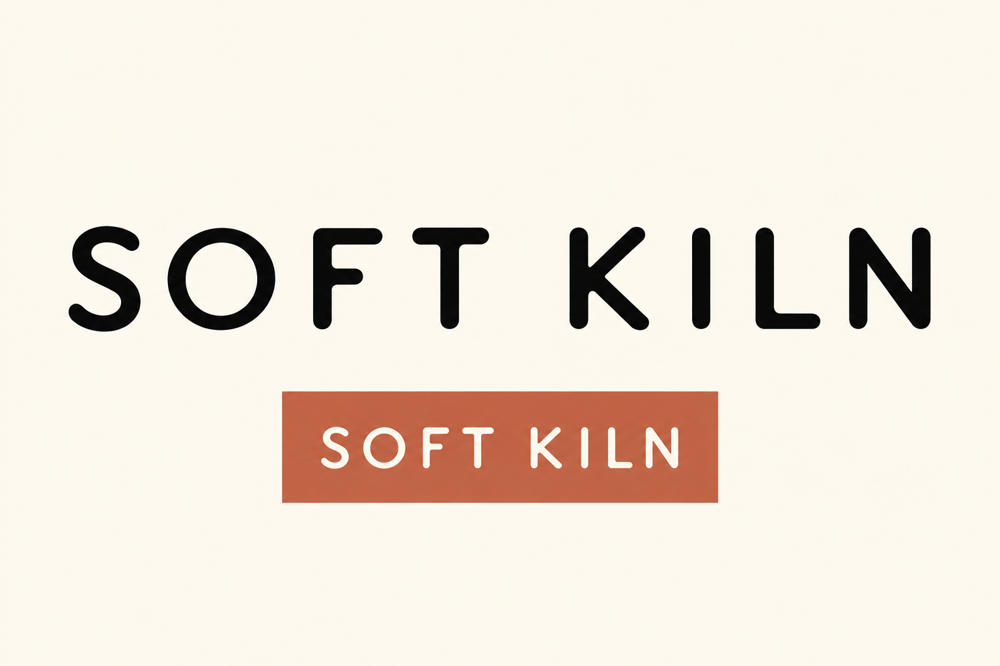
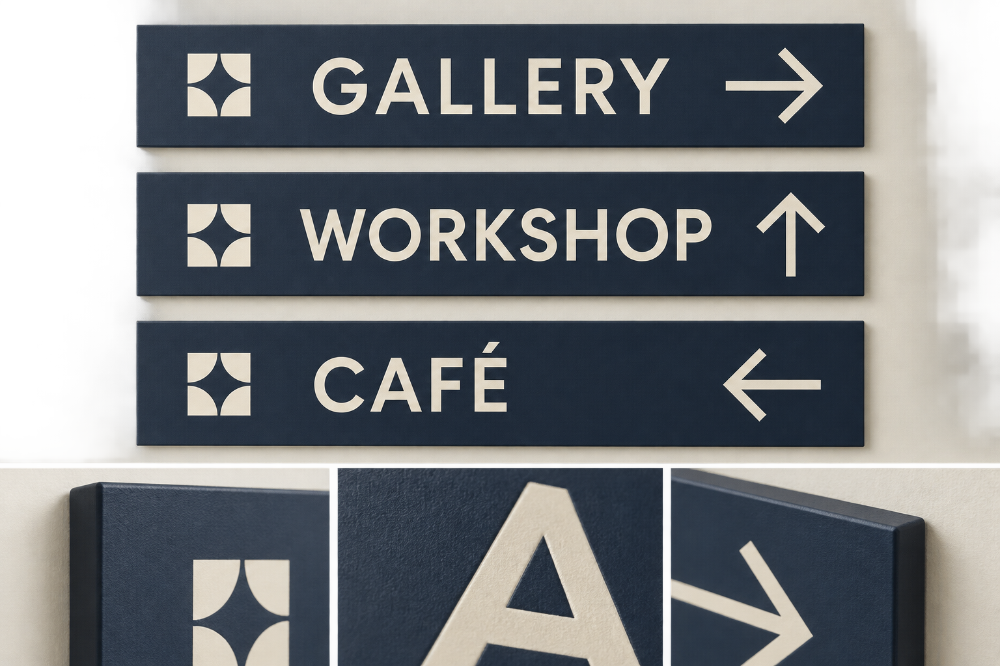
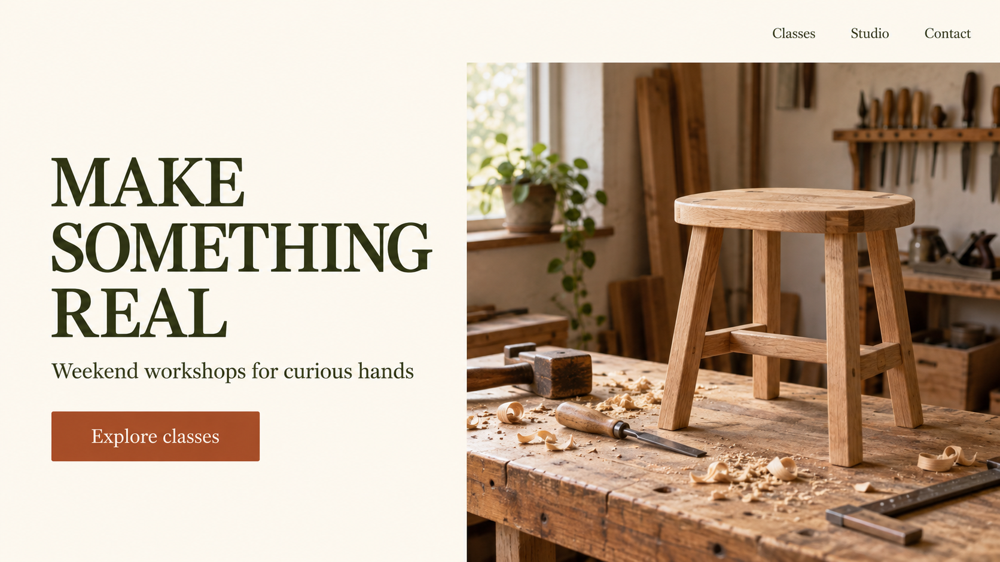
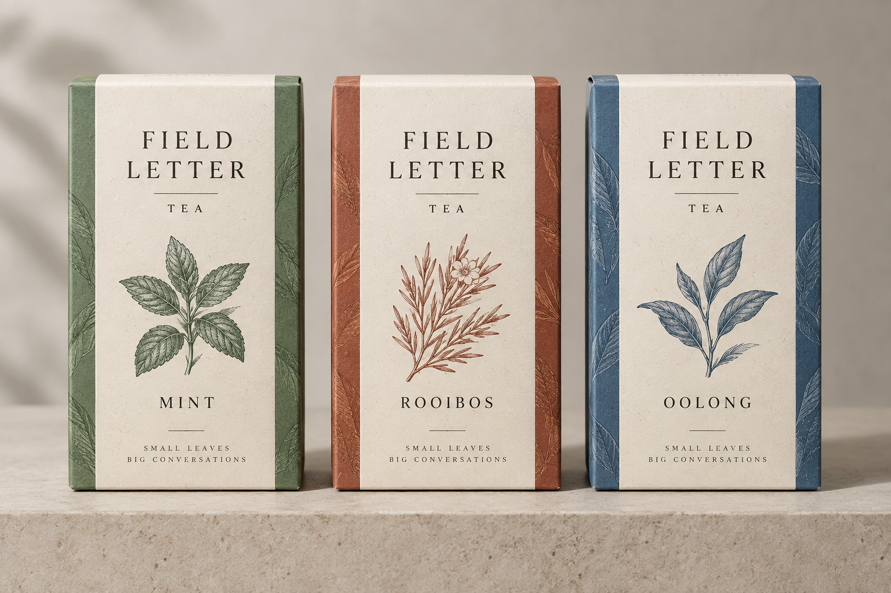
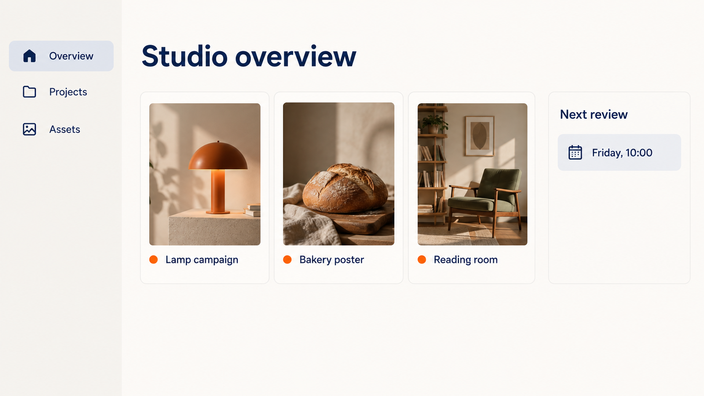

# Brand identity & interface concepts · 品牌识别与界面概念

[All recipes / 全部配方](README.md)

Images 2.5 workflow focus: **System consistency / 视觉系统一致性**.

Copy one language block. For edits, attach the images named in the prompt in that order. Requested ratios are creative targets; verify actual output dimensions.

任选一种语言复制。编辑任务须按提示顺序附参考图；比例为创作目标，输出后核对实际尺寸。

- [P031 · Independent ceramics wordmark](#p031)
- [P032 · Museum wayfinding family](#p032)
- [P033 · Book-club mobile app concept](#p033)
- [P034 · Workshop booking landing page](#p034)
- [P035 · Tea packaging family](#p035)
- [P036 · Creator dashboard concept](#p036)

<a id="p031"></a>
## P031 · Independent ceramics wordmark / 独立陶艺品牌字标

**Mode:** generate · **Target:** 3:2 · **Author:** FLAQ team (original); Flyne AI edition

**Best for:** Brand direction and interface presentation concepts.

**Inputs:** No reference upload is required for this default text-to-image prompt.

**Production check:** Check spelling and hierarchy; redraw final vectors or implement actual interface components separately. Use the target ratio as a framing request; inspect actual pixel dimensions before export.

**Generated example / 已生成示例：** Exact executed prompts and review notes are in the [generation log](../docs/generation-log.md). These examples do not verify every template variation.

**Example inputs, in order / 示例输入顺序：**

[Input 1 / 输入 1](../assets/images/example-p031.png)



[Independent ceramics wordmark — refined result: exact prompt / 实际提示词](../assets/generation/example-p031-v2.txt)

**Observed review:** Black wordmark and cream reverse lettering on clay are readable on an opaque light background. This is raster concept artwork, not a vector logo.

### English

```text
Asset: Independent ceramics wordmark. Target aspect ratio: 3:2. Mode: generate.
Explore an original wordmark "SOFT KILN" for a small ceramics studio. Show one primary black wordmark large on warm ivory, with subtly rounded terminals and broad letter spacing, plus one small reversed version on a terracotta rectangle below. Keep it flat, monochrome and suitable for later vector reconstruction.
Constraints: No copied logo shapes, faux trademark marks, 3D mockups or additional names.
Render only explicitly requested image text. Do not add unrelated logos, signatures or captions.
```

### 简体中文

```text
交付物：独立陶艺品牌字标。目标比例：3:2。模式：新建。
探索小陶艺工作室原创字标“SOFT KILN”。暖象牙底大黑字，字端微圆、宽字距，下方陶土矩形中放一版小反白字。平面、单色，可供后期矢量重建。
约束：不复制已有标形、不加商标符号、3D样机或其他名称。
只渲染明确要求的图中文字，不添加无关标识、签名或说明。
```

### Next edit / 后续修改

```text
Adjust only the spacing between F and T, preserving every letterform.
```

```text
只调整F与T间距，保留字形。
```

**Review / 验收：** Read both sizes; review originality and rebuild vectors before production. 检查两种尺寸，审查独特性并在生产前重建矢量。

[Back to index / 返回索引](README.md)


<a id="p032"></a>
## P032 · Museum wayfinding family / 博物馆导视系统

**Mode:** generate · **Target:** 3:2 · **Author:** FLAQ team (original); Flyne AI edition

**Best for:** Brand direction and interface presentation concepts.

**Inputs:** No reference upload is required for this default text-to-image prompt.

**Production check:** Check spelling and hierarchy; redraw final vectors or implement actual interface components separately. Use the target ratio as a framing request; inspect actual pixel dimensions before export.

**Generated example / 已生成示例：** Exact executed prompts and review notes are in the [generation log](../docs/generation-log.md). These examples do not verify every template variation.



[Museum wayfinding family — generated example: exact prompt / 实际提示词](../assets/generation/example-p032.txt)

**Observed review:** Three signs, readable labels and correct arrow directions are present; the matching square motif is more decorative than a plain square.

### English

```text
Asset: Museum wayfinding family. Target aspect ratio: 3:2. Mode: generate.
Create a wayfinding concept board for a fictional craft museum. Three matching matte navy signs on cream read "GALLERY →", "WORKSHOP ↑", "CAFÉ ←" in large ivory sans serif. Add a small consistent geometric square symbol to each. Present signs front-on with a narrow material detail strip below.
Constraints: Preserve arrow directions and equal text sizes; no emergency-exit or accessibility certification claims.
Render only explicitly requested image text. Do not add unrelated logos, signatures or captions.
```

### 简体中文

```text
交付物：博物馆导视系统。目标比例：3:2。模式：新建。
为虚构工艺博物馆设计导视概念板，三块统一哑光深蓝标牌，象牙无衬线大字“GALLERY →”“WORKSHOP ↑”“CAFÉ ←”，各有统一几何方块符号。正面展示，下方窄材料细节条。
约束：保持箭头方向和字号一致，不作紧急出口或无障碍认证声明。
只渲染明确要求的图中文字，不添加无关标识、签名或说明。
```

### Next edit / 后续修改

```text
Change only sign material to painted wood while retaining navy and ivory colors.
```

```text
只将材质改为涂漆木板，保留深蓝和象牙色。
```

**Review / 验收：** Check arrows and legibility; validate physical signage separately. 检查箭头与可读性，实际导视另行验证。

[Back to index / 返回索引](README.md)


<a id="p033"></a>
## P033 · Book-club mobile app concept / 读书会移动应用概念

**Mode:** generate · **Target:** 4:5 · **Author:** FLAQ team (original); Flyne AI edition

**Best for:** Brand direction and interface presentation concepts.

**Inputs:** No reference upload is required for this default text-to-image prompt.

**Production check:** Check spelling and hierarchy; redraw final vectors or implement actual interface components separately. Use the target ratio as a framing request; inspect actual pixel dimensions before export.

**Generated example / 已生成示例：** Exact executed prompts and review notes are in the [generation log](../docs/generation-log.md). These examples do not verify every template variation.


[Book-club mobile app concept — generated example: exact prompt / 实际提示词](../assets/generation/example-p033.txt)

**Observed review:** All requested labels and the primary button are readable; this is a raster UI concept with no implemented interaction.

### English

```text
Asset: Book-club mobile app concept. Target aspect ratio: 4:5. Mode: generate.
Make a front-facing mobile UI concept with a cream canvas and deep-plum text. Header "THIS WEEK"; a large illustrated book card titled "The Quiet Orchard"; below two simple rows "Thursday discussion" and "Notes to revisit"; one primary button "Join the conversation". Use generous touch-sized spacing and a single-column hierarchy.
Constraints: Raster design concept, not functional software; no device frame, invented reviews or personal data.
Render only explicitly requested image text. Do not add unrelated logos, signatures or captions.
```

### 简体中文

```text
交付物：读书会移动应用概念。目标比例：4:5。模式：新建。
制作正视移动UI概念，奶油画布、深梅色文字。顶部“THIS WEEK”，大插画书卡“The Quiet Orchard”，两行“Thursday discussion”“Notes to revisit”，主按钮“Join the conversation”。单栏层级、充足触控间距。
约束：位图设计概念而非功能软件，不加设备框、虚构评价或个人数据。
只渲染明确要求的图中文字，不添加无关标识、签名或说明。
```

### Next edit / 后续修改

```text
Change only the primary button to dark green; keep layout and wording.
```

```text
只将主按钮改深绿，保持布局和文字。
```

**Review / 验收：** Review button contrast, padding and text truncation; implement UI separately. 检查按钮对比、内边距和文字截断，界面需另外实现。

[Back to index / 返回索引](README.md)


<a id="p034"></a>
## P034 · Workshop booking landing page / 工作坊预约落地页概念

**Mode:** generate · **Target:** 16:9 · **Author:** FLAQ team (original); Flyne AI edition

**Best for:** Brand direction and interface presentation concepts.

**Inputs:** No reference upload is required for this default text-to-image prompt.

**Production check:** Check spelling and hierarchy; redraw final vectors or implement actual interface components separately. Use the target ratio as a framing request; inspect actual pixel dimensions before export.

**Generated example / 已生成示例：** Exact executed prompts and review notes are in the [generation log](../docs/generation-log.md). These examples do not verify every template variation.



[Workshop booking landing page — generated example: exact prompt / 实际提示词](../assets/generation/example-p034.txt)

**Observed review:** Headline, supporting copy, navigation and button are readable; stool looks completed rather than half-built.

### English

```text
Asset: Workshop booking landing page. Target aspect ratio: 16:9. Mode: generate.
Design a desktop landing-page visual for a fictional woodworking school. Left column headline "MAKE SOMETHING REAL", a short line "Weekend workshops for curious hands", and button "Explore classes". Right column warm photograph of tools and a half-built wooden stool. Cream background, dark olive type, rust accent, broad margins and restrained navigation "Classes  Studio  Contact".
Constraints: No invented testimonials, availability, checkout UI or extra navigation.
Render only explicitly requested image text. Do not add unrelated logos, signatures or captions.
```

### 简体中文

```text
交付物：工作坊预约落地页概念。目标比例：16:9。模式：新建。
设计虚构木工学校桌面落地页视觉。左栏“MAKE SOMETHING REAL”、短句“Weekend workshops for curious hands”、按钮“Explore classes”；右栏工具和半成品木凳暖调照片。奶油背景、深橄榄字、铁锈强调、宽边距，导航“Classes  Studio  Contact”。
约束：不添加虚构证言、空位、结账界面或额外导航。
只渲染明确要求的图中文字，不添加无关标识、签名或说明。
```

### Next edit / 后续修改

```text
Replace only the hero photo with a hand-planed wooden bowl scene, preserving the grid.
```

```text
仅把主图替换成手工木碗场景，保留网格。
```

**Review / 验收：** Check exact copy and whether headline dominates without covering the product. 检查准确文案及标题是否突出且不挡主体。

[Back to index / 返回索引](README.md)


<a id="p035"></a>
## P035 · Tea packaging family / 茶叶包装家族

**Mode:** generate · **Target:** 3:2 · **Author:** FLAQ team (original); Flyne AI edition

**Best for:** Brand direction and interface presentation concepts.

**Inputs:** No reference upload is required for this default text-to-image prompt.

**Production check:** Check spelling and hierarchy; redraw final vectors or implement actual interface components separately. Use the target ratio as a framing request; inspect actual pixel dimensions before export.

**Generated example / 已生成示例：** Exact executed prompts and review notes are in the [generation log](../docs/generation-log.md). These examples do not verify every template variation.



[Tea packaging family — generated example: exact prompt / 实际提示词](../assets/generation/example-p035.txt)

**Observed review:** Three cartons and requested variant names are legible. Extra TEA and SMALL LEAVES BIG CONVERSATIONS copy was generated; remove or approve this before production.

### English

```text
Asset: Tea packaging family. Target aspect ratio: 3:2. Mode: generate.
Create three matching paper tea cartons for fictional "FIELD LETTER". Same geometry and cream label system; variants "MINT", "ROOIBOS", "OOLONG" use green, rust and blue side panels. Arrange front-facing cartons on a neutral plinth with consistent scale and readable titles. Natural paper fibers, soft studio shadows.
Constraints: Exactly three cartons; no health promises, weights, certifications or barcodes. The only visible lettering is FIELD LETTER and the three variant names; leave all other package areas free of slogans or invented copy.
Render only explicitly requested image text. Do not add unrelated logos, signatures or captions.
```

### 简体中文

```text
交付物：茶叶包装家族。目标比例：3:2。模式：新建。
为虚构“FIELD LETTER”制作三款统一纸茶盒，同一结构和奶油标签；“MINT”“ROOIBOS”“OOLONG”分别搭配绿、铁锈、蓝侧板。等比例正面排列于中性台面，标题可读、天然纸纤维、柔和影棚阴影。
约束：仅三个盒子，不加健康承诺、重量、认证和条码。 只显示FIELD LETTER和三种口味名称，其他包装区域不添加口号或虚构文案。
只渲染明确要求的图中文字，不添加无关标识、签名或说明。
```

### Next edit / 后续修改

```text
Change only the OOLONG side-panel blue to deeper navy.
```

```text
只把OOLONG侧板蓝改为更深海军蓝。
```

**Review / 验收：** Compare label baseline, carton proportions and variant spelling. 比较标签基线、盒体比例与品名拼写。

[Back to index / 返回索引](README.md)


<a id="p036"></a>
## P036 · Creator dashboard concept / 创作者工作台概念

**Mode:** generate · **Target:** 16:9 · **Author:** FLAQ team (original); Flyne AI edition

**Best for:** Brand direction and interface presentation concepts.

**Inputs:** No reference upload is required for this default text-to-image prompt.

**Production check:** Check spelling and hierarchy; redraw final vectors or implement actual interface components separately. Use the target ratio as a framing request; inspect actual pixel dimensions before export.

**Generated example / 已生成示例：** Exact executed prompts and review notes are in the [generation log](../docs/generation-log.md). These examples do not verify every template variation.



[Creator dashboard concept — generated example: exact prompt / 实际提示词](../assets/generation/example-p036.txt)

**Observed review:** Sidebar, three project cards and review time are readable; spacing is coherent for a dashboard concept.

### English

```text
Asset: Creator dashboard concept. Target aspect ratio: 16:9. Mode: generate.
Create a calm desktop dashboard concept for a fictional studio. Left sidebar "Overview", "Projects", "Assets". Main heading "Studio overview"; three project cards labeled "Lamp campaign", "Bakery poster", "Reading room" with small original thumbnails. A right panel "Next review" contains "Friday, 10:00". Off-white canvas, navy typography and orange status dots.
Constraints: No fabricated live metrics or real customer data; conceptual UI only.
Render only explicitly requested image text. Do not add unrelated logos, signatures or captions.
```

### 简体中文

```text
交付物：创作者工作台概念。目标比例：16:9。模式：新建。
制作虚构工作室桌面看板概念，左侧“Overview”“Projects”“Assets”，主标题“Studio overview”；三项目卡“Lamp campaign”“Bakery poster”“Reading room”配原创小图，右栏“Next review”内“Friday, 10:00”。米白、深蓝字、橙色状态点。
约束：不编造实时指标或真实客户数据，仅UI概念。
只渲染明确要求的图中文字，不添加无关标识、签名或说明。
```

### Next edit / 后续修改

```text
Increase only project thumbnail height without changing sidebar or text.
```

```text
仅增加项目缩略图高度，不改侧栏和文字。
```

**Review / 验收：** Check alignment, consistent cards and distinguishable controls. 检查对齐、卡片一致性和控件可区分性。

[Back to index / 返回索引](README.md)
