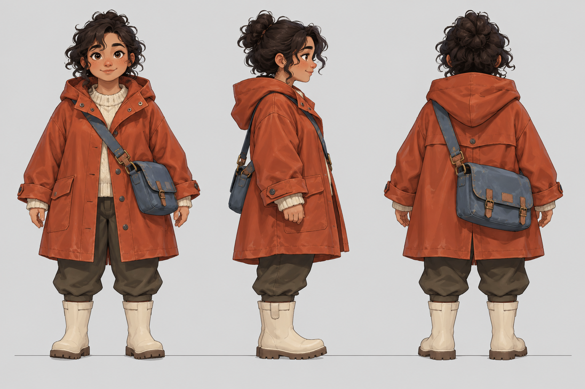
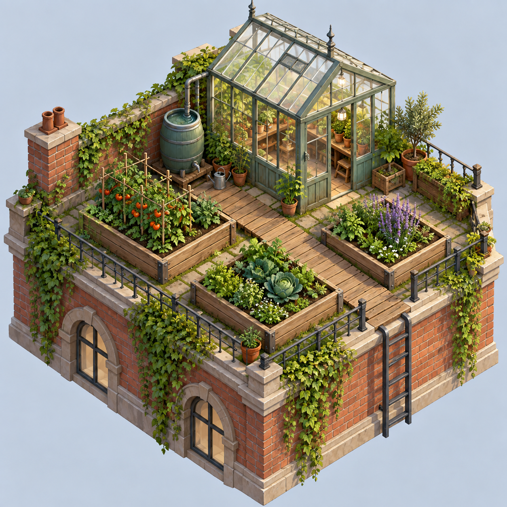

# Comics, characters & game art · 漫画、角色与游戏美术

[All recipes / 全部配方](README.md)

Images 2.5 workflow focus: **Sequential consistency / 连续叙事一致性**.

Copy one language block. For edits, attach the images named in the prompt in that order. Requested ratios are creative targets; verify actual output dimensions.

任选一种语言复制。编辑任务须按提示顺序附参考图；比例为创作目标，输出后核对实际尺寸。

- [P037 · Paper moon repair story](#p037)
- [P038 · Character turnaround sheet](#p038)
- [P039 · Four-expression mascot sheet](#p039)
- [P040 · Cozy game inventory icons](#p040)
- [P041 · Isometric rooftop garden](#p041)
- [P042 · Pixel-art harbor background](#p042)

<a id="p037"></a>
## P037 · Paper moon repair story / 修补纸月亮六格故事

**Mode:** generate · **Target:** 3:2 · **Author:** FLAQ team (original); Flyne AI edition

**Best for:** Story pitching, character development and game concept art.

**Inputs:** No reference upload is required for this default text-to-image prompt.

**Production check:** Check continuity, cell counts and small-scale silhouettes before extracting individual frames. Use the target ratio as a framing request; inspect actual pixel dimensions before export.

**Generated example / 已生成示例：** Exact executed prompts and review notes are in the [generation log](../docs/generation-log.md). These examples do not verify every template variation.


[Wordless storyboard: exact prompt / 实际提示词](../assets/generation/paper-moon-story.txt)

**Observed review:** Six panels and recognizable robot retained. Panel three shows stitches before the dedicated stitching panel; medium is more dimensional than requested. Teaching example requiring continuity revision.

### English

```text
Asset: Paper moon repair story. Target aspect ratio: 3:2. Mode: generate.
Create a six-panel wordless story in a 3×2 grid. A cream repair robot with one amber eye and teal apron finds a torn paper moon in an attic, lifts its halves, selects orange thread, stitches the seam, hangs the moon, then rests beneath its glow. Use gouache and colored-pencil texture, ivory gutters, warm peach and muted teal with ink-blue dusk.
Constraints: Keep robot design and workshop recognizable across panels; exactly six panels, no dialogue.
Render only explicitly requested image text. Do not add unrelated logos, signatures or captions.
```

### 简体中文

```text
交付物：修补纸月亮六格故事。目标比例：3:2。模式：新建。
创作3×2六格无字故事：奶油色修理机器人、单只琥珀眼、青绿围裙，在阁楼发现破纸月亮，拿起两半，选橙线，缝合，挂起，最后坐在月光下。水粉彩铅质感、象牙格缝、暖桃和灰青绿、墨蓝暮色。
约束：保持各格机器人和工作室可辨识一致，恰好六格，无对白。
只渲染明确要求的图中文字，不添加无关标识、签名或说明。
```

### Next edit / 后续修改

```text
Edit only panel three so the moon is still unstitched while the robot selects the thread.
```

```text
仅改第三格：机器人选线时月亮仍未缝合。
```

**Review / 验收：** Check action order, apron continuity and whether repair happens too early. 检查动作顺序、围裙一致性及是否提前出现修好状态。

[Back to index / 返回索引](README.md)


<a id="p038"></a>
## P038 · Character turnaround sheet / 原创角色转面表

**Mode:** generate · **Target:** 3:2 · **Author:** FLAQ team (original); Flyne AI edition

**Best for:** Story pitching, character development and game concept art.

**Inputs:** No reference upload is required for this default text-to-image prompt.

**Production check:** Check continuity, cell counts and small-scale silhouettes before extracting individual frames. Use the target ratio as a framing request; inspect actual pixel dimensions before export.

**Generated example / 已生成示例：** Exact executed prompts and review notes are in the [generation log](../docs/generation-log.md). These examples do not verify every template variation.



[Character turnaround sheet — generated example: exact prompt / 实际提示词](../assets/generation/example-p038.txt)

**Observed review:** Three equal-scale front, side and back views share a baseline; satchel placement and costume folds should be reconciled before production modeling.

### English

```text
Asset: Character turnaround sheet. Target aspect ratio: 3:2. Mode: generate.
Design an original courier character for a cozy adventure game: short adult with curly dark hair, oversized rust raincoat, blue satchel and cream boots. Show front, side and back views at equal scale, standing on one baseline against light gray. Clean hand-painted game concept style with clear costume construction.
Constraints: Same character and costume in all views; no weapons, text or background props.
Render only explicitly requested image text. Do not add unrelated logos, signatures or captions.
```

### 简体中文

```text
交付物：原创角色转面表。目标比例：3:2。模式：新建。
为温馨冒险游戏设计原创信使：矮个成年人、深色卷发、宽松铁锈雨衣、蓝挎包、奶油靴。浅灰底同一基线等比例正侧背三视图，干净手绘游戏概念风，服装结构清楚。
约束：三视图同角色同服装，不加武器、文字和场景道具。
只渲染明确要求的图中文字，不添加无关标识、签名或说明。
```

### Next edit / 后续修改

```text
Change only satchel color to forest green consistently in all three views.
```

```text
只将三视图挎包统一改森林绿。
```

**Review / 验收：** Compare coat hem, strap side, boot height and head scale. 对比衣摆、肩带侧、靴高和头部比例。

[Back to index / 返回索引](README.md)


<a id="p039"></a>
## P039 · Four-expression mascot sheet / 吉祥物四表情表

**Mode:** generate · **Target:** 1:1 · **Author:** FLAQ team (original); Flyne AI edition

**Best for:** Story pitching, character development and game concept art.

**Inputs:** No reference upload is required for this default text-to-image prompt.

**Production check:** Check continuity, cell counts and small-scale silhouettes before extracting individual frames. Use the target ratio as a framing request; inspect actual pixel dimensions before export.

**Generated example / 已生成示例：** Exact executed prompts and review notes are in the [generation log](../docs/generation-log.md). These examples do not verify every template variation.

**Example inputs, in order / 示例输入顺序：**

[Input 1 / 输入 1](../assets/images/example-p039.png)


[Four-expression mascot sheet — refined result: exact prompt / 实际提示词](../assets/generation/example-p039-v2.txt)

**Observed review:** Four distinct expressions are visible on cream without the previous transparent background. Leaf placement and pebble texture remain coherent.

### English

```text
Asset: Four-expression mascot sheet. Target aspect ratio: 1:1. Mode: generate.
Create a 2×2 expression sheet for an original round pebble creature with two tiny leaf ears and one orange cheek spot. Expressions are curious, delighted, sleepy and surprised. Keep the same front-facing head size and pastel clay material in every cell on cream. Distinct expressions should come from eyelids and mouth, not changing the character.
Constraints: Exactly four heads, no bodies, words or additional facial markings.
Render only explicitly requested image text. Do not add unrelated logos, signatures or captions.
```

### 简体中文

```text
交付物：吉祥物四表情表。目标比例：1:1。模式：新建。
为原创圆卵石生物制作2×2表情表，两片小叶耳、一个橙色脸颊斑。表情好奇、开心、困倦、惊讶。每格同正脸头部尺寸和粉彩黏土材质、奶油底，靠眼睑嘴巴表达，不改角色。
约束：仅四个头，不加身体、文字和额外面部斑纹。
只渲染明确要求的图中文字，不添加无关标识、签名或说明。
```

### Next edit / 后续修改

```text
Make only the sleepy expression’s eyelids lower.
```

```text
仅让困倦表情眼睑更低。
```

**Review / 验收：** Check ear shape, cheek-spot side and equal head dimensions. 检查耳形、脸斑方向和等大头部。

[Back to index / 返回索引](README.md)


<a id="p040"></a>
## P040 · Cozy game inventory icons / 温馨游戏物品图标

**Mode:** generate · **Target:** 1:1 · **Author:** FLAQ team (original); Flyne AI edition

**Best for:** Story pitching, character development and game concept art.

**Inputs:** No reference upload is required for this default text-to-image prompt.

**Production check:** Check continuity, cell counts and small-scale silhouettes before extracting individual frames. Use the target ratio as a framing request; inspect actual pixel dimensions before export.

**Generated example / 已生成示例：** Exact executed prompts and review notes are in the [generation log](../docs/generation-log.md). These examples do not verify every template variation.

**Example inputs, in order / 示例输入顺序：**

[Input 1 / 输入 1](../assets/images/example-p040.png)


[Cozy game inventory icons — refined result: exact prompt / 实际提示词](../assets/generation/example-p040-v2.txt)

**Observed review:** Nine distinct game objects are visible on cream without the previous transparent background. This is a concept sheet requiring slicing for production.

### English

```text
Asset: Cozy game inventory icons. Target aspect ratio: 1:1. Mode: generate.
Create nine original inventory icons in a 3×3 evenly spaced grid: acorn, lantern, rolled map, teacup, seed pouch, brass key, folded scarf, wooden spoon and mushroom. Use softly shaded hand-painted forms, one top-left light direction and cream background. Strong silhouettes readable at small size.
Constraints: One item per cell, no text or UI border; this is an atlas concept requiring extraction.
Render only explicitly requested image text. Do not add unrelated logos, signatures or captions.
```

### 简体中文

```text
交付物：温馨游戏物品图标。目标比例：1:1。模式：新建。
生成3×3九个原创物品图标：橡子、提灯、卷地图、茶杯、种子袋、黄铜钥匙、折叠围巾、木勺、蘑菇。柔和手绘明暗，统一左上光，奶油底，轮廓小尺寸清楚。
约束：每格一物，不加字或UI框；图集概念需后续拆分。
只渲染明确要求的图中文字，不添加无关标识、签名或说明。
```

### Next edit / 后续修改

```text
Change only the lantern glow from yellow to pale blue.
```

```text
只将提灯光由黄改浅蓝。
```

**Review / 验收：** Count nine distinct items and inspect equal padding before export. 导出前检查九个不同物件及等距留白。

[Back to index / 返回索引](README.md)


<a id="p041"></a>
## P041 · Isometric rooftop garden / 等距屋顶花园游戏场景

**Mode:** generate · **Target:** 1:1 · **Author:** FLAQ team (original); Flyne AI edition

**Best for:** Story pitching, character development and game concept art.

**Inputs:** No reference upload is required for this default text-to-image prompt.

**Production check:** Check continuity, cell counts and small-scale silhouettes before extracting individual frames. Use the target ratio as a framing request; inspect actual pixel dimensions before export.

**Generated example / 已生成示例：** Exact executed prompts and review notes are in the [generation log](../docs/generation-log.md). These examples do not verify every template variation.



[Isometric rooftop garden — generated example: exact prompt / 实际提示词](../assets/generation/example-p041.txt)

**Observed review:** Greenhouse, three main raised beds and a barrel are present with visible walkway; extra small planters were added.

### English

```text
Asset: Isometric rooftop garden. Target aspect ratio: 1:1. Mode: generate.
Draw an isometric game environment of a tiny rooftop greenhouse. Include a glass structure at back, three raised planting beds, one water barrel and a narrow timber walkway. Moss green, warm brick and pale glass palette; detailed hand-painted textures with clear navigable spaces. Keep the whole floating rooftop tile visible.
Constraints: Consistent isometric angles, no text, no characters and no hidden crop at tile edges. Count exactly three raised beds across the entire tile; do not add small planter boxes or background beds.
Render only explicitly requested image text. Do not add unrelated logos, signatures or captions.
```

### 简体中文

```text
交付物：等距屋顶花园游戏场景。目标比例：1:1。模式：新建。
绘制等距小型屋顶温室游戏场景：后方玻璃温室、三个种植床、一个水桶、窄木走道。苔绿、暖砖、浅玻璃，精细手绘纹理和清楚可行走空间，完整显示悬浮屋顶地块。
约束：等距角一致，不加字和角色，不裁地块边缘。 整个地块严格只有三个高架种植床，不额外添加小花箱或背景种植床。
只渲染明确要求的图中文字，不添加无关标识、签名或说明。
```

### Next edit / 后续修改

```text
Add only a folded orange watering hose beside the barrel.
```

```text
仅在水桶旁添加折叠橙色水管。
```

**Review / 验收：** Inspect glass perspective, walkway continuity and object scale. 检查玻璃透视、走道连续和物件比例。

[Back to index / 返回索引](README.md)


<a id="p042"></a>
## P042 · Pixel-art harbor background / 像素港湾游戏背景

**Mode:** generate · **Target:** 16:9 · **Author:** FLAQ team (original); Flyne AI edition

**Best for:** Story pitching, character development and game concept art.

**Inputs:** No reference upload is required for this default text-to-image prompt.

**Production check:** Check continuity, cell counts and small-scale silhouettes before extracting individual frames. Use the target ratio as a framing request; inspect actual pixel dimensions before export.

**Generated example / 已生成示例：** Exact executed prompts and review notes are in the [generation log](../docs/generation-log.md). These examples do not verify every template variation.


[Pixel-art harbor background — generated example: exact prompt / 实际提示词](../assets/generation/example-p042.txt)

**Observed review:** Harbor layout and dusk palette match the brief; pixel-art appearance is illustrative rather than an enforced fixed pixel grid.

### English

```text
Asset: Pixel-art harbor background. Target aspect ratio: 16:9. Mode: generate.
Create an original pixel-art seaside harbor at blue hour. Put fishing sheds at left, quiet moored boats in the middle and a lighthouse far right. Restrict the visual palette to navy, slate, muted coral and warm yellow windows. Keep foreground water simple and a clear middle band for game characters.
Constraints: Pixel-art appearance is requested, not a guaranteed exact pixel grid; no text or borrowed game assets.
Render only explicitly requested image text. Do not add unrelated logos, signatures or captions.
```

### 简体中文

```text
交付物：像素港湾游戏背景。目标比例：16:9。模式：新建。
创作蓝调时刻原创像素海港：左边渔棚、中间静泊小船、右远方灯塔。视觉限深蓝、石板灰、灰珊瑚、暖黄窗，前景水面简洁，中间留游戏角色活动带。
约束：要求像素风外观而非保证精确像素网格，不加字或借用游戏素材。
只渲染明确要求的图中文字，不添加无关标识、签名或说明。
```

### Next edit / 后续修改

```text
Change only window-light color to pale amber; preserve silhouettes and layout.
```

```text
只把窗光改浅琥珀，保留轮廓和布局。
```

**Review / 验收：** Check pixel consistency; rebuild to target game resolution if needed. 检查像素一致性，需要时按游戏目标分辨率重建。

[Back to index / 返回索引](README.md)
