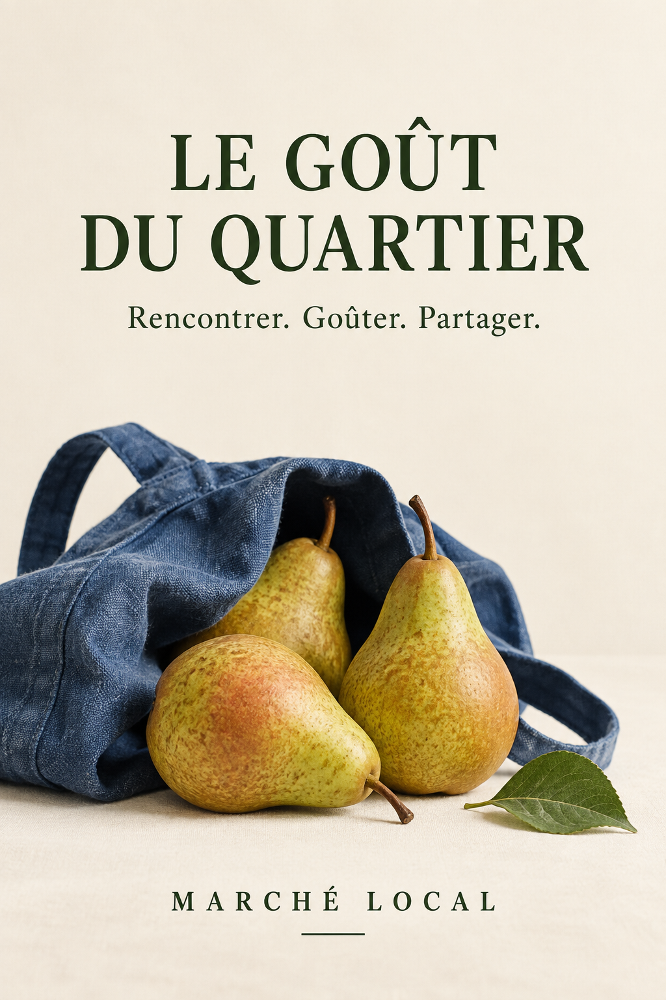
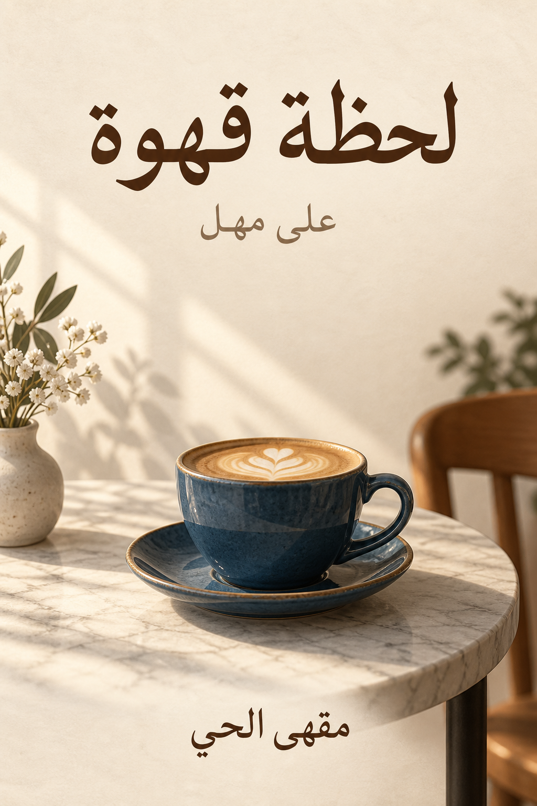

# Multilingual image prompts · 多语言图像提示词

[All recipes / 全部配方](README.md)

12 complete localized briefs. These are language-specific recipes, not full translations of the entire library. Generated lettering requires fluent review before publication; see each example and its review record.

12 条完整本地语言创作简报，不代表全库已翻译为12种语言。配图中的文字需由熟练读者审校；具体结果参见各示例及审查记录。

<a id="l001"></a>
## L001 · English · Repair workshop flyer

```text
Create a portrait 2:3 flyer for a fictional neighborhood repair workshop. Use cream recycled-paper texture, one blue ceramic mug repaired with a visible orange seam, and a small spool of thread near the bottom. Put exactly "MAKE IT LAST" at the top, "REPAIR WORKSHOP" underneath, and "BRING ONE OBJECT" at the bottom. Use dark navy type with generous line spacing, wide margins and no extra words. Keep the mug fully visible and its handle intact.
```

**Review:** Check all three text strings and avoid invented event details.

### Next edit / 后续修改

Run this only after reviewing the first result / 首次结果审查后再单独执行。

```text
Follow-up: change only the bottom line to "START WITH ONE REPAIR"; preserve the illustration, color palette and headline.
```


[Exact generation prompt / 实际生成提示词](../assets/generation/example-l001.txt)

**Observed review:** All three English lines are readable; blue repaired mug and orange thread match the initial generation brief.

<a id="l002"></a>
## L002 · 简体中文 · 城市慢生活海报

```text
生成一张2:3竖版城市慢生活海报。奶油纸背景，下半部为一把钴蓝折叠椅和一株斜伸入画的橄榄枝，午后自然光形成柔和长影，呈现真实布料纹理。上方大标题严格写“把周末还给自己”，下方小字“坐一会儿，也很好”，底部仅“慢慢生活”。中文采用清楚的现代黑体，标点完整，行距宽松，不加入英文、日期、地址或品牌。保持椅子结构可信。
```

**Review:** 逐字核对简体字、逗号和行距；检查折叠椅支架。

### Next edit / 后续修改

Run this only after reviewing the first result / 首次结果审查后再单独执行。

```text
后续只把椅子布面改为铁锈色，文字、橄榄枝和光线保持不变。
```


[Exact generation prompt / 实际生成提示词](../assets/generation/example-l002.txt)

**Observed review:** Three Chinese lines are readable; extra full stops appear after the supporting line and footer, and a blanket/book/cup were added. Review exact punctuation before reuse.

<a id="l003"></a>
## L003 · 日本語 · ベーカリーポスター

```text
架空のベーカリーのために、縦2:3のポスターを制作してください。温かいクリーム色の紙を背景に、藍色の陶器皿に載せた、手で割ったクロワッサンを下半分に大きく配置します。左上から朝日が入り、薄い生地の層とパンくずが自然に見える写真表現にしてください。上部の見出しは正確に「焼きたての朝」、その下は「A SLOW MORNING」、下部は「KOMOREBI BAKE」のみ。余白を広く取り、日本語を読みやすくしてください。
```

**Review:** 「焼きたての朝」の字形、欧文の綴り、余白を確認してください。

### Next edit / 后续修改

Run this only after reviewing the first result / 首次结果审查后再单独执行。

```text
修正では皿の色だけを深緑に変更し、パンと文字は維持してください。
```


[Exact generation prompt / 实际生成提示词](../assets/generation/komorebi-bakery.txt)

**Observed review:** Three requested text strings visually match. Portrait is 2:3. Native editorial review remains recommended.

<a id="l004"></a>
## L004 · 한국어 · 독립 서점 포스터

```text
가상의 독립 서점을 위한 세로 2:3 포스터를 만드세요. 따뜻한 아이보리 종이 배경 아래쪽에 펼쳐진 책 한 권과 짙은 파란색 머그잔을 놓고, 창문에서 들어오는 부드러운 오후 빛을 표현하세요. 위쪽 큰 제목은 정확히 “오늘은 책 한 권”, 아래 작은 문구는 “천천히 읽는 시간”, 맨 아래는 “작은 책방”으로 쓰세요. 한글 음절을 분리하지 말고 넉넉한 줄 간격과 여백을 유지하세요. 추가 문자나 가격은 넣지 마세요.
```

**Review:** 한글 받침, 띄어쓰기, 문구 누락과 컵 손잡이를 확인하세요.

### Next edit / 后续修改

Run this only after reviewing the first result / 首次结果审查后再单独执行。

```text
다음 수정에서는 머그잔 색상만 올리브색으로 바꾸고 책과 글자는 유지하세요.
```


[Exact generation prompt / 实际生成提示词](../assets/generation/example-l004.txt)

**Observed review:** Three Korean lines and navy mug are visible; additional tiny book text and background decor appear. Native-language proofread remains recommended.

<a id="l005"></a>
## L005 · Español · Cartel de café

```text
Crea un cartel vertical 2:3 para una cafetería ficticia. Sobre papel crema, muestra una taza de cerámica azul con café y una pequeña cucharilla, iluminadas por luz lateral de mañana. Coloca arriba el texto exacto "UN CAFÉ, SIN PRISA", debajo "Haz una pausa" y al pie "CAFÉ DE BARRIO". Usa tipografía azul oscuro, márgenes amplios y una jerarquía clara. Conserva las tildes y la coma; no añadas precios ni direcciones.
```

**Review:** Revisa las tildes de CAFÉ, la coma y que no aparezcan palabras adicionales.

### Next edit / 后续修改

Run this only after reviewing the first result / 首次结果审查后再单独执行。

```text
En la siguiente edición, cambia únicamente el color de la taza a verde oliva y mantén el texto, las sombras y la composición.
```


[Exact generation prompt / 实际生成提示词](../assets/generation/example-l005.txt)

**Observed review:** Headline accent and comma are retained; three Spanish text elements read correctly at inspection size.

<a id="l006"></a>
## L006 · Français · Affiche de marché

```text
Crée une affiche verticale 2:3 pour un marché de quartier fictif. Sur un papier ivoire, compose une nature morte avec trois poires, un sac en toile bleu et une petite feuille verte. Éclairage naturel doux, textures réalistes et grande zone vide en haut. Inscris exactement "LE GOÛT DU QUARTIER", puis "Rencontrer. Goûter. Partager." et en bas "MARCHÉ LOCAL". Utilise une typographie vert foncé, des marges généreuses et des accents correctement dessinés. N’ajoute ni date ni adresse.
```

**Review:** Vérifier Û, û, É, les points et le nombre de poires.

### Next edit / 后续修改

Run this only after reviewing the first result / 首次结果审查后再单独执行。

```text
Pour la retouche, change seulement le sac bleu en terre cuite, en préservant tout le texte.
```



[Exact generation prompt / 实际生成提示词](../assets/generation/example-l006.txt)

**Observed review:** Three pears, blue bag and the three French text strings are visible; accents and punctuation read correctly at inspection size.

<a id="l007"></a>
## L007 · Deutsch · Werkstattplakat

```text
Gestalte ein Hochformatplakat im Verhältnis 2:3 für eine fiktive offene Werkstatt. Auf cremefarbenem Papier liegen ein kleiner Holzlöffel, ein Schleifklotz und eingerolltes orangefarbenes Garn. Weiches Seitenlicht zeigt Holzmaserung und Papierstruktur. Oben steht exakt "ZEIT FÜRS SELBERMACHEN", darunter "Eine Idee. Deine Hände." und unten "OFFENE WERKSTATT". Verwende dunkelblaue Schrift und breite Ränder. Lange Wörter dürfen sinnvoll umbrochen, aber nicht verändert werden. Keine Preise oder erfundenen Veranstaltungsdaten.
```

**Review:** Umlaute in FÜRS und Hände sowie Wortumbrüche prüfen.

### Next edit / 后续修改

Run this only after reviewing the first result / 首次结果审查后再单独执行。

```text
Ändere anschließend nur die Garnfarbe zu Salbeigrün; behalte Schrift und Anordnung bei.
```


[Exact generation prompt / 实际生成提示词](../assets/generation/example-l007.txt)

**Observed review:** Long German headline remains intact across two lines; umlauts and supporting copy are visible.

<a id="l008"></a>
## L008 · Português · Cartaz de padaria

```text
Crie um cartaz vertical 2:3 para uma padaria fictícia. Mostre um pão redondo cortado sobre um pano de linho azul, em fundo creme com luz suave da manhã. A crosta deve ter textura natural, sem brilho plástico. Escreva exatamente "PÃO, TEMPO E AFETO" no alto, "Feito para compartilhar" abaixo e "PADARIA DA ESQUINA" no rodapé. Preserve o til de PÃO, mantenha margens largas e não acrescente preços, selos ou endereços.
```

**Review:** Conferir PÃO, a vírgula, as três linhas de texto e a textura do pão.

### Next edit / 后续修改

Run this only after reviewing the first result / 首次结果审查后再单独执行。

```text
Na revisão, altere apenas o pano para verde-oliva; mantenha o pão, a iluminação e todas as palavras.
```


[Exact generation prompt / 实际生成提示词](../assets/generation/example-l008.txt)

**Observed review:** PÃO retains its tilde; all three Portuguese lines are readable and bread/linen textures are coherent.

<a id="l009"></a>
## L009 · العربية · ملصق مقهى

```text
صمّم ملصقاً عمودياً بنسبة 2:3 لمقهى خيالي. استخدم خلفية ورقية بلون كريمي، وفنجان قهوة أزرق على طاولة حجرية مع ضوء صباحي ناعم من اليسار. ضع العنوان «لحظة قهوة» في الأعلى، والعبارة «على مهل» تحته، و«مقهى الحي» في الأسفل. اجعل النص العربي من اليمين إلى اليسار بحروف متصلة وواضحة وهوامش واسعة. لا تضف أسعاراً أو عنواناً أو كلمات أخرى.
```

**Review:** راجع اتصال الحروف واتجاه الكتابة وترتيب الكلمات مع قارئ متمكن من العربية.

### Next edit / 后续修改

Run this only after reviewing the first result / 首次结果审查后再单独执行。

```text
في التعديل التالي غيّر لون الفنجان فقط إلى الأخضر الزيتي، مع الحفاظ على النص والضوء وتكوين الصورة.
```



[Exact generation prompt / 实际生成提示词](../assets/generation/example-l009.txt)

**Observed review:** Three connected right-to-left Arabic text areas are visible with wide spacing; native-language proofreading remains recommended.

<a id="l010"></a>
## L010 · हिन्दी · पुस्तकालय पोस्टर

```text
एक काल्पनिक सामुदायिक पुस्तकालय के लिए 2:3 अनुपात का खड़ा पोस्टर बनाइए। क्रीम रंग के कागज़ पर नीचे एक खुली पुस्तक, नीला कप और छोटी हरी पत्ती रखें। खिड़की से आती नरम रोशनी और असली कागज़ की बनावट दिखाएँ। ऊपर ठीक “किताबों के साथ एक शाम”, उसके नीचे “धीरे पढ़ें, गहराई से सोचें” और सबसे नीचे “हमारा पुस्तकालय” लिखें। देवनागरी की मात्राएँ और संयुक्त अक्षर सही रखें, पंक्तियों के बीच पर्याप्त जगह दें। कोई तारीख या कीमत न जोड़ें।
```

**Review:** मात्राएँ, संयुक्त अक्षर, अल्पविराम और ऊपर की शिरोरेखा जाँचें।

### Next edit / 后续修改

Run this only after reviewing the first result / 首次结果审查后再单独执行。

```text
अगले संपादन में केवल कप को मिट्टी के लाल रंग में बदलें; पाठ और प्रकाश यथावत रखें।
```


[Exact generation prompt / 实际生成提示词](../assets/generation/example-l010-v2.txt)

**Observed review:** Extra lettering on wall, mug and closed book spines is removed. Main Hindi text remains prominent; fine simulated print persists on the open book. Fluent Hindi proofreading is required.

<a id="l011"></a>
## L011 · ไทย · โปสเตอร์ร้านชา

```text
สร้างโปสเตอร์แนวตั้งอัตราส่วน 2:3 สำหรับร้านชาสมมติ ใช้พื้นหลังกระดาษสีครีม วางถ้วยเซรามิกสีน้ำเงินกับใบชาสองใบในครึ่งล่าง ให้แสงเช้าที่นุ่มนวลแสดงผิวสัมผัสของถ้วยอย่างเป็นธรรมชาติ ด้านบนเขียนตรงตามนี้ว่า “พักสักนิด” ใต้หัวเรื่องเขียน “จิบชาอย่างช้า ๆ” และด้านล่างเขียน “ร้านชาเล็ก ๆ” ใช้ตัวอักษรไทยที่อ่านง่าย เว้นระยะบรรทัดให้สระและวรรณยุกต์ไม่ชนกัน ไม่เพิ่มราคา ที่อยู่ หรือข้อความอื่น
```

**Review:** ตรวจสระ วรรณยุกต์ ช่องว่าง และเครื่องหมาย ๆ กับผู้อ่านภาษาไทยที่คล่องแคล่ว

### Next edit / 后续修改

Run this only after reviewing the first result / 首次结果审查后再单独执行。

```text
ในการแก้ไขครั้งถัดไป เปลี่ยนเฉพาะสีถ้วยเป็นสีเขียวมะกอก โดยคงข้อความและแสงเดิมไว้
```


[Exact generation prompt / 实际生成提示词](../assets/generation/example-l011.txt)

**Observed review:** Three Thai text blocks and a quiet tea composition are present. Fluent Thai proofreading is still required before publication.

<a id="l012"></a>
## L012 · Русский · Афиша мастерской

```text
Создай вертикальную афишу 2:3 для вымышленной мастерской. На кремовой бумаге покажи деревянную ложку, клубок оранжевой нити и небольшую синюю чашку. Мягкий боковой свет подчёркивает фактуру дерева и бумаги. Сверху напиши точно «СДЕЛАНО С ТЕПЛОМ», ниже «Время создавать», внизу «ОТКРЫТАЯ МАСТЕРСКАЯ». Используй тёмно-синий шрифт, широкие поля и ясную иерархию. Не заменяй кириллицу похожими латинскими буквами и не добавляй адрес или цену.
```

**Review:** Проверить кириллицу, отсутствие латинских подмен и правильность всех слов.

### Next edit / 后续修改

Run this only after reviewing the first result / 首次结果审查后再单独执行。

```text
В следующей правке измени только цвет нити на зелёный, сохранив текст и композицию.
```


[Exact generation prompt / 实际生成提示词](../assets/generation/example-l012.txt)

**Observed review:** Cyrillic headline, subtitle and footer are clearly separated. Obtain fluent Russian proofreading before publication.
