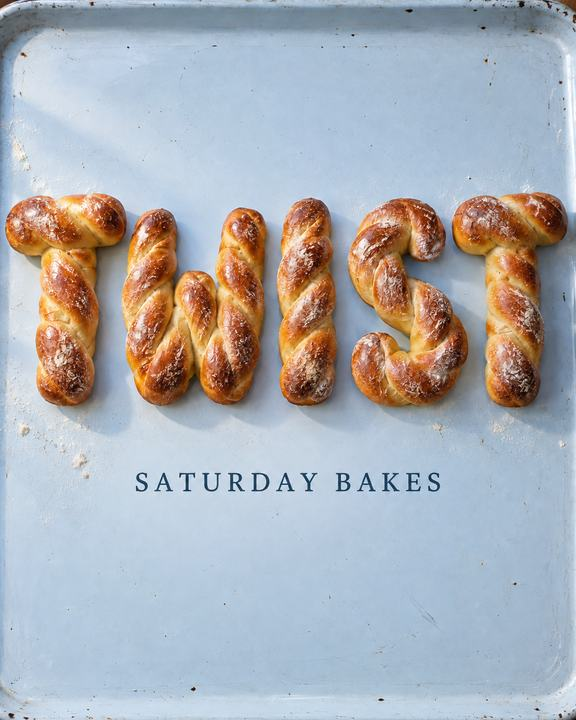
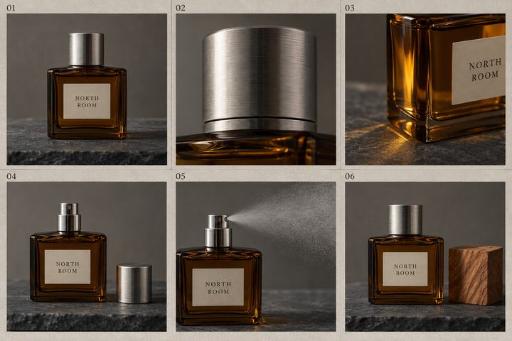
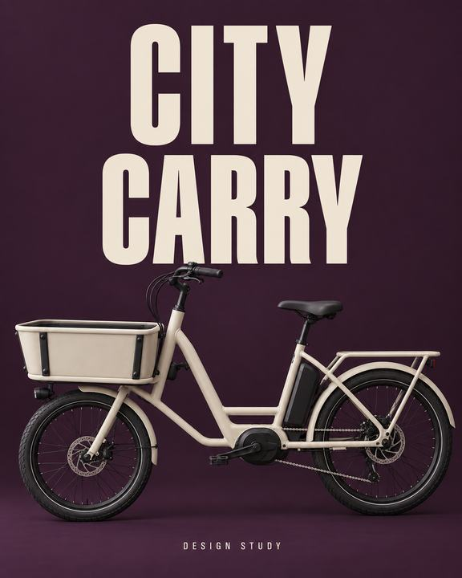
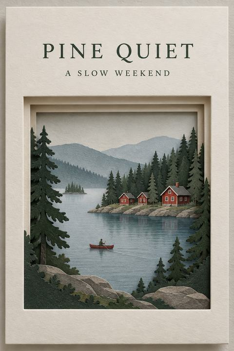
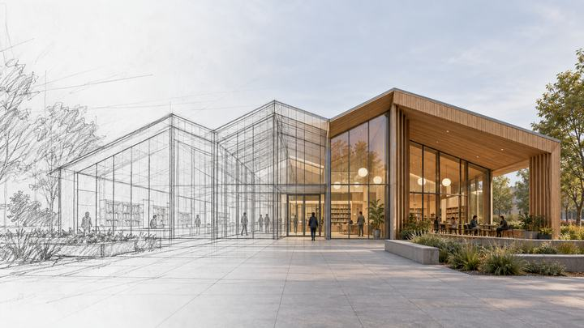
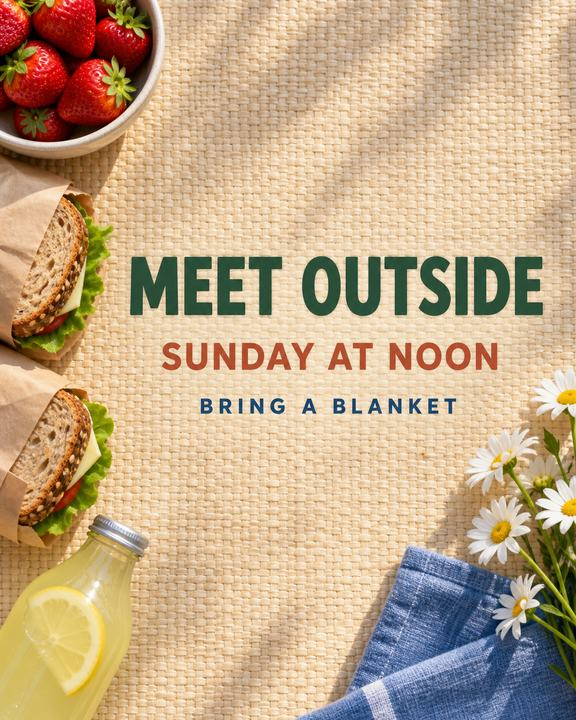

# X community: practical visual briefs · X 社区实用场景

[All recipes / 全部配方](README.md)

Images 2.5 workflow focus: **Source-attributed English adaptations and external image references**.

Copy one language block. For edits, attach the images named in the prompt in that order. Requested ratios are creative targets; verify actual output dimensions.

任选一种语言复制。编辑任务须按提示顺序附参考图；比例为创作目标，输出后核对实际尺寸。

- [P086 · Ingredient-built bakery lettering](#p086)
- [P087 · Six-frame fragrance launch board](#p087)
- [P088 · Editorial mobility concept poster](#p088)
- [P089 · Paper-window weekend destination card](#p089)
- [P090 · Sketch-to-building concept reveal](#p090)
- [P091 · Community picnic announcement](#p091)

<a id="p086"></a>
## P086 · Ingredient-built bakery lettering

**Mode:** generate · **Target:** 4:5 · **Author:** FLAQ team (original); Flyne AI edition

**Flyne input guide / 输入说明:** 0 reference image(s) / 张参考图。Check prompt length and output requirements / 核对提示词长度与输出要求。 [Details / 详情](../docs/recipe-access.md). Input fit is not a platform test / 符合输入限制不代表已实测。

**Language:** English. Expanded adaptation; see the result status and source information below.

**Best for:** Source-attributed campaign and presentation concepts.

**Inputs:** No reference upload is required for this default text-to-image prompt.

**Production check:** Use the repository result to assess the adapted brief; the linked X preview illustrates a different original prompt. Use the target ratio as a framing request; inspect actual pixel dimensions before export.

**Scenario source:** [Loriel.AI (@ou_zhen599) on X](https://x.com/ou_zhen599/status/2099406905714348431) · Published 2026-09-14 · Checked 2026-09-14.

**Source idea:** Food advertising with lettering assembled from ingredients.

**What changed:** Replaces the pasta campaign with bakery lettering, different copy, material and a simpler two-level layout.

[](https://x.com/ou_zhen599/status/2099406905714348431/photo/1)

**External reference image:** [View the original photo on X](https://x.com/ou_zhen599/status/2099406905714348431/photo/1). This is the source author’s image, not a rendering of the adapted prompt below. It is hosted remotely and is outside this repository’s MIT license. The model attribution is the author’s claim, not an independent verification. [Curation notes](../docs/x-community.md).

**Generated example / 已生成示例：** Exact executed prompts and review notes are in the [generation log](../docs/generation-log.md). These examples do not verify every template variation.

**Example inputs, in order / 示例输入顺序：**

[Input 1 / 输入 1](../assets/images/example-p086.png)

[](../assets/images/example-p086-v2.png)

[Ingredient-built bakery lettering — refined result: exact prompt / 实际提示词](../assets/generation/example-p086-v2.txt)

**Observed review:** The follow-up separates all five letters in TWIST and retains SATURDAY BAKES. Bread shapes and tray details are slightly reinterpreted.

### Customize

**Bakery product:** braided dough. **Alternatives:** pretzel dough or seeded bread. **Preserve:** word structure and spacing.

### English

```text
Asset: Ingredient-built bakery lettering. Target aspect ratio: 4:5. Mode: generate.
Develop a launch poster for the fictional bakery LOOP & CRUMB. Construct the single word TWIST from braided baked dough on a pale blue enamel surface. Use a straight overhead camera. Make the letters occupy the upper two thirds, with a separate small printed line reading SATURDAY BAKES beneath them. Show browned crust, occasional flour and the braided joints at close range. Leave generous separation between the five letters and use one consistent morning light direction. This is a bakery window poster that must remain readable as a phone thumbnail.
Constraints: Exactly five edible letters; no sauce, badges or background word patterns. Keep holes and gaps open. Render TWIST as T-W-I-S-T. Treat LOOP & CRUMB as brief context only; do not print the brand name.
Render only explicitly requested image text. Do not add unrelated logos, signatures or captions.
```

### Next edit / 后续修改

```text
Change the enamel surface to warm ivory while preserving the dough shapes, shadows and all text.
```

**Review / 验收：** Read TWIST at thumbnail size; inspect intersections for fused dough, inconsistent shadows and extra characters.

[Back to index / 返回索引](README.md)


<a id="p087"></a>
## P087 · Six-frame fragrance launch board

**Mode:** generate · **Target:** 3:2 · **Author:** FLAQ team (original); Flyne AI edition

**Flyne input guide / 输入说明:** 0 reference image(s) / 张参考图。Check prompt length and output requirements / 核对提示词长度与输出要求。 [Details / 详情](../docs/recipe-access.md). Input fit is not a platform test / 符合输入限制不代表已实测。

**Language:** English. Expanded adaptation; see the result status and source information below.

**Best for:** Source-attributed campaign and presentation concepts.

**Inputs:** No reference upload is required for this default text-to-image prompt.

**Production check:** Use the repository result to assess the adapted brief; the linked X preview illustrates a different original prompt. Use the target ratio as a framing request; inspect actual pixel dimensions before export.

**Scenario source:** [M-studioAi (@Strength04_X) on X](https://x.com/Strength04_X/status/2097919290980921451) · Published 2026-09-10 · Checked 2026-09-14.

**Source idea:** Product storyboard with a consistent fragrance bottle across shots.

**What changed:** Reduces ten scenes to six still frames, changes the product and lighting, and adds explicit continuity checks.

[](https://x.com/Strength04_X/status/2097919290980921451/photo/2)

**External reference image:** [View the original photo on X](https://x.com/Strength04_X/status/2097919290980921451/photo/2). This is the source author’s image, not a rendering of the adapted prompt below. It is hosted remotely and is outside this repository’s MIT license. The model attribution is the author’s claim, not an independent verification. [Curation notes](../docs/x-community.md).

**Generated example / 已生成示例：** Exact executed prompts and review notes are in the [generation log](../docs/generation-log.md). These examples do not verify every template variation.

[](../assets/images/example-p087.png)

[Six-frame fragrance launch board — generated example: exact prompt / 实际提示词](../assets/generation/example-p087.txt)

**Observed review:** Six numbered panels and NORTH ROOM labels are visible; cap removal and mist sequence read clearly. Product continuity is conceptual, not pixel-exact.

### Customize

**Fragrance direction:** cedar on slate. **Alternatives:** citrus on limestone or tea on ceramic. **Preserve:** bottle shape, label and six-shot sequence.

### English

```text
Asset: Six-frame fragrance launch board. Target aspect ratio: 3:2. Mode: generate.
Create a static six-panel presentation board for a fictional cedar fragrance named NORTH ROOM. Use a precise three-column, two-row grid on warm gray paper. The product is a squat amber rectangular glass bottle with a brushed silver cylindrical cap and an ivory NORTH ROOM label. Read left to right: full bottle on slate; close-up of the cap seam; side light through amber liquid; uncapped bottle with the cap resting beside it; atomizer releasing a fine mist; final bottle beside a small cedar block. Number the frames 01 through 06 in identical outside gutters. Keep the same bottle geometry and studio surface throughout.
Constraints: A single still image, not a video or GIF. Six panels only. No floating cap, invented performance claims or additional text.
Render only explicitly requested image text. Do not add unrelated logos, signatures or captions.
```

### Next edit / 后续修改

```text
Correct only panel 05 so the mist originates at the atomizer; preserve all other panels and gutters.
```

**Review / 验收：** Count six frames, compare caps and labels, inspect mist origin. Animation and sound require a separate production step.

[Back to index / 返回索引](README.md)


<a id="p088"></a>
## P088 · Editorial mobility concept poster

**Mode:** generate · **Target:** 4:5 · **Author:** FLAQ team (original); Flyne AI edition

**Flyne input guide / 输入说明:** 0 reference image(s) / 张参考图。Check prompt length and output requirements / 核对提示词长度与输出要求。 [Details / 详情](../docs/recipe-access.md). Input fit is not a platform test / 符合输入限制不代表已实测。

**Language:** English. Expanded adaptation; see the result status and source information below.

**Best for:** Source-attributed campaign and presentation concepts.

**Inputs:** No reference upload is required for this default text-to-image prompt.

**Production check:** Use the repository result to assess the adapted brief; the linked X preview illustrates a different original prompt. Use the target ratio as a framing request; inspect actual pixel dimensions before export.

**Scenario source:** [ᴍᴜʀᴘʜʏ (@Diplomeme) on X](https://x.com/Diplomeme/status/2097641872068063436) · Published 2026-09-09 · Checked 2026-09-14.

**Source idea:** A vehicle hero image combined with bold type and a compact specification hierarchy.

**What changed:** Changes the automotive advertisement to an unbranded mobility design study and removes unsupported specifications.

[](https://x.com/Diplomeme/status/2097641872068063436/photo/1)

**External reference image:** [View the original photo on X](https://x.com/Diplomeme/status/2097641872068063436/photo/1). This is the source author’s image, not a rendering of the adapted prompt below. It is hosted remotely and is outside this repository’s MIT license. The model attribution is the author’s claim, not an independent verification. [Curation notes](../docs/x-community.md).

**Generated example / 已生成示例：** Exact executed prompts and review notes are in the [generation log](../docs/generation-log.md). These examples do not verify every template variation.

[](../assets/images/example-p088.png)

[Editorial mobility concept poster — generated example: exact prompt / 实际提示词](../assets/generation/example-p088.txt)

**Observed review:** CITY CARRY and DESIGN STUDY are readable; two wheels and a front cargo box are present. Mechanical connections remain concept art, not a buildable bicycle specification.

### Customize

**Mobility product:** cargo bicycle. **Alternatives:** folding bicycle or commuter scooter. **Preserve:** one hero object and clear type separation.

### English

```text
Asset: Editorial mobility concept poster. Target aspect ratio: 4:5. Mode: generate.
Design an editorial concept poster for an unbranded compact electric cargo bicycle. Use a deep aubergine background and a matte cream bicycle viewed from its left side, positioned across the lower half. Show a sturdy front cargo box, two wheels, a visible chain and practical handlebars. Set the title CITY / CARRY in large pale cream condensed lettering in the upper half. Add only DESIGN STUDY in a small aligned footer. Separate the typography from the bicycle silhouette with ample breathing room. Use gentle studio light to reveal painted metal and rubber without a glossy showroom effect.
Constraints: No vehicle logos, fabricated range or speed figures, QR codes or duplicated wheels. Keep the frame mechanically plausible. CITY and CARRY are separate lines; do not print the slash.
Render only explicitly requested image text. Do not add unrelated logos, signatures or captions.
```

### Next edit / 后续修改

```text
Change only the cargo box to muted orange; keep wheels, frame, camera and typography fixed.
```

**Review / 验收：** Check wheel count, handlebar connection, frame joints and exact title. Inspect phone-size readability.

[Back to index / 返回索引](README.md)


<a id="p089"></a>
## P089 · Paper-window weekend destination card

**Mode:** generate · **Target:** 2:3 · **Author:** FLAQ team (original); Flyne AI edition

**Flyne input guide / 输入说明:** 0 reference image(s) / 张参考图。Check prompt length and output requirements / 核对提示词长度与输出要求。 [Details / 详情](../docs/recipe-access.md). Input fit is not a platform test / 符合输入限制不代表已实测。

**Language:** English. Expanded adaptation; see the result status and source information below.

**Best for:** Source-attributed campaign and presentation concepts.

**Inputs:** No reference upload is required for this default text-to-image prompt.

**Production check:** Use the repository result to assess the adapted brief; the linked X preview illustrates a different original prompt. Use the target ratio as a framing request; inspect actual pixel dimensions before export.

**Scenario source:** [Loriel.AI (@ou_zhen599) on X](https://x.com/ou_zhen599/status/2098729446094287023) · Published 2026-09-12 · Checked 2026-09-14.

**Source idea:** A miniature destination revealed through layered paper.

**What changed:** Uses a fictional lake, rectangular aperture and reduced copy rather than reproducing the coastal tourism composition.

[](https://x.com/ou_zhen599/status/2098729446094287023/photo/1)

**External reference image:** [View the original photo on X](https://x.com/ou_zhen599/status/2098729446094287023/photo/1). This is the source author’s image, not a rendering of the adapted prompt below. It is hosted remotely and is outside this repository’s MIT license. The model attribution is the author’s claim, not an independent verification. [Curation notes](../docs/x-community.md).

**Generated example / 已生成示例：** Exact executed prompts and review notes are in the [generation log](../docs/generation-log.md). These examples do not verify every template variation.

[](../assets/images/example-p089.png)

[Paper-window weekend destination card — generated example: exact prompt / 实际提示词](../assets/generation/example-p089.txt)

**Observed review:** Both requested text lines, three red cabins and a canoe are visible; layered paper depth reads clearly.

### Customize

**Landscape:** fictional lake retreat. **Alternatives:** desert observatory or mountain refuge. **Preserve:** paper depth and two-line hierarchy.

### English

```text
Asset: Paper-window weekend destination card. Target aspect ratio: 2:3. Mode: generate.
Create a tactile travel concept card for a fictional lakeside retreat named PINE QUIET. A rectangular opening in thick ivory card reveals a tiny Nordic-inspired lake, three red cabins and dark pines. Give the opening stepped paper layers with soft consistent shadows, as if the landscape is built inside a shallow box. Keep the upper quarter clean for the title PINE QUIET and the smaller line A SLOW WEEKEND. Place a single small canoe on the lake to establish scale. Use restrained forest green, muted brick red and mist blue, photographed in diffuse window light.
Constraints: No real location claims, maps, coordinates, travel stamps or crowded collage elements. Keep all cabins aligned to the ground.
Render only explicitly requested image text. Do not add unrelated logos, signatures or captions.
```

### Next edit / 后续修改

```text
Move the lighting from morning to overcast afternoon without changing the paper opening, cabins, typography or canoe.
```

**Review / 验收：** Inspect paper edge depth and shadow direction; check canoe scale, title spelling and three-cabin count.

[Back to index / 返回索引](README.md)


<a id="p090"></a>
## P090 · Sketch-to-building concept reveal

**Mode:** generate · **Target:** 16:9 · **Author:** FLAQ team (original); Flyne AI edition

**Flyne input guide / 输入说明:** 0 reference image(s) / 张参考图。Check prompt length and output requirements / 核对提示词长度与输出要求。 [Details / 详情](../docs/recipe-access.md). Input fit is not a platform test / 符合输入限制不代表已实测。

**Language:** English. Expanded adaptation; see the result status and source information below.

**Best for:** Source-attributed campaign and presentation concepts.

**Inputs:** No reference upload is required for this default text-to-image prompt.

**Production check:** Use the repository result to assess the adapted brief; the linked X preview illustrates a different original prompt. Use the target ratio as a framing request; inspect actual pixel dimensions before export.

**Scenario source:** [Xiao Yang (@XiaoKooeye) on X](https://x.com/XiaoKooeye/status/2099408374249169169) · Published 2026-09-14 · Checked 2026-09-14.

**Source idea:** A hand-drawn architectural idea transitions into a rendered building.

**What changed:** Expands a short Chinese concept into an English architectural presentation brief with a new building and continuity criteria.

[](https://x.com/XiaoKooeye/status/2099408374249169169/photo/1)

**External reference image:** [View the original photo on X](https://x.com/XiaoKooeye/status/2099408374249169169/photo/1). This is the source author’s image, not a rendering of the adapted prompt below. It is hosted remotely and is outside this repository’s MIT license. The model attribution is the author’s claim, not an independent verification. [Curation notes](../docs/x-community.md).

**Generated example / 已生成示例：** Exact executed prompts and review notes are in the [generation log](../docs/generation-log.md). These examples do not verify every template variation.

[](../assets/images/example-p090.png)

[Sketch-to-building concept reveal — generated example: exact prompt / 实际提示词](../assets/generation/example-p090.txt)

**Observed review:** Sketch, wireframe and timber facade form one coherent scene. The roof reads as repeated pitched bays rather than a clearly stepped roof; treat it as an exploratory visualization.

### Customize

**Building use:** neighborhood library. **Alternatives:** community gallery or visitor center. **Preserve:** three roof bays and shared perspective.

### English

```text
Asset: Sketch-to-building concept reveal. Target aspect ratio: 16:9. Mode: generate.
Produce a single architectural concept illustration for a fictional neighborhood library. Across one continuous horizon, let a loose graphite sketch on the left develop through a restrained wireframe zone into a finished timber-and-glass building on the right. Preserve the same three stepped roof bays throughout the transition. Show one accessible ground-level entrance, a sheltered reading terrace and a few small adult silhouettes for scale. Use a neutral sky and quiet plaza so the progression from line to material remains the subject. Maintain one camera position and one vanishing-point system across the entire composition.
Constraints: One static visualization; not a construction drawing. No named architect imitation, impossible cantilevers, labels or animation claims.
Render only explicitly requested image text. Do not add unrelated logos, signatures or captions.
```

### Next edit / 后续修改

```text
Make only the middle wireframe zone narrower, preserving the building footprint and the finished right-hand facade.
```

**Review / 验收：** Trace each roof bay across the transition and check perspective continuity, entrance scale and structural plausibility.

[Back to index / 返回索引](README.md)


<a id="p091"></a>
## P091 · Community picnic announcement

**Mode:** generate · **Target:** 4:5 · **Author:** FLAQ team (original); Flyne AI edition

**Flyne input guide / 输入说明:** 0 reference image(s) / 张参考图。Check prompt length and output requirements / 核对提示词长度与输出要求。 [Details / 详情](../docs/recipe-access.md). Input fit is not a platform test / 符合输入限制不代表已实测。

**Language:** English. Expanded adaptation; see the result status and source information below.

**Best for:** Source-attributed campaign and presentation concepts.

**Inputs:** No reference upload is required for this default text-to-image prompt.

**Production check:** Use the repository result to assess the adapted brief; the linked X preview illustrates a different original prompt. Use the target ratio as a framing request; inspect actual pixel dimensions before export.

**Scenario source:** [Loriel.AI (@ou_zhen599) on X](https://x.com/ou_zhen599/status/2099407139836166552) · Published 2026-09-14 · Checked 2026-09-14.

**Source idea:** Food frames an open central area reserved for readable event text.

**What changed:** Changes the surface, object arrangement and copy into a practical community announcement with explicit readability checks.

[](https://x.com/ou_zhen599/status/2099407139836166552/photo/1)

**External reference image:** [View the original photo on X](https://x.com/ou_zhen599/status/2099407139836166552/photo/1). This is the source author’s image, not a rendering of the adapted prompt below. It is hosted remotely and is outside this repository’s MIT license. The model attribution is the author’s claim, not an independent verification. [Curation notes](../docs/x-community.md).

**Generated example / 已生成示例：** Exact executed prompts and review notes are in the [generation log](../docs/generation-log.md). These examples do not verify every template variation.

[](../assets/images/example-p091.png)

[Community picnic announcement — generated example: exact prompt / 实际提示词](../assets/generation/example-p091.txt)

**Observed review:** All three invitation lines are readable and the central mat remains clear; the food and napkin are partly cropped at the edges as a poster treatment.

### Customize

**Seasonal food:** strawberries. **Alternatives:** peaches or grapes. **Preserve:** empty center and three-line invitation.

### English

```text
Asset: Community picnic announcement. Target aspect ratio: 4:5. Mode: generate.
Create a community picnic announcement photographed directly overhead on a pale woven mat. Arrange a strawberry bowl, two sandwiches wrapped in plain paper and one lemonade bottle along the left edge. Place a folded blue linen napkin and a small bunch of daisies at the bottom right. Reserve the central half as uninterrupted mat texture. Center the exact text MEET OUTSIDE, then SUNDAY AT NOON, then BRING A BLANKET in three distinct typographic levels. Use soft afternoon light and believable contact shadows. Aim for a friendly neighborhood invitation with sufficient contrast for mobile sharing.
Constraints: No extra utensils, real sponsor logos, invented address or food covering the text. No distressed or cursive text.
Render only explicitly requested image text. Do not add unrelated logos, signatures or captions.
```

### Next edit / 后续修改

```text
Replace only the strawberries with sliced peaches; preserve food positions, mat texture and all typography.
```

**Review / 验收：** Check each line character by character and confirm objects do not intrude into the central text area.

[Back to index / 返回索引](README.md)
