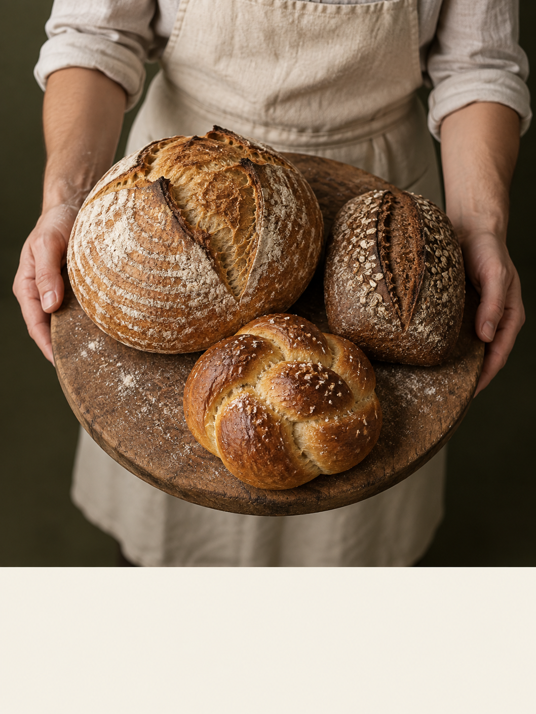
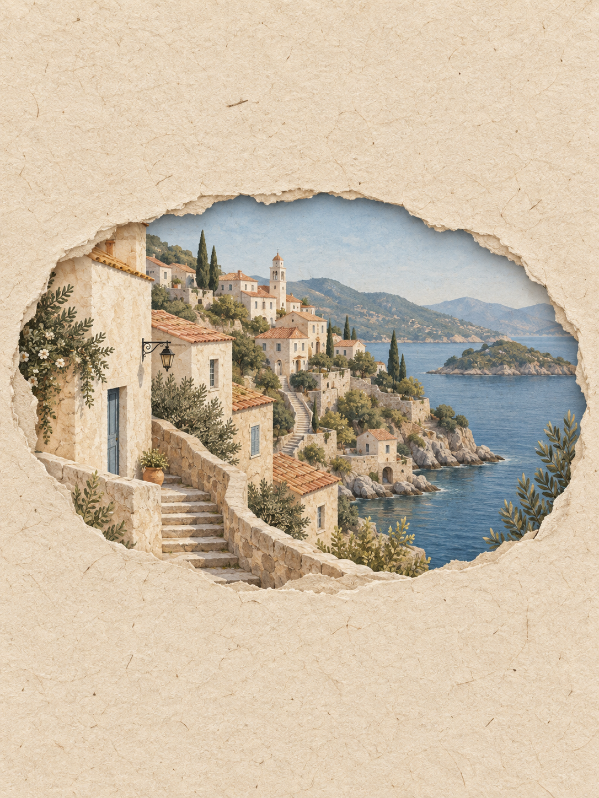
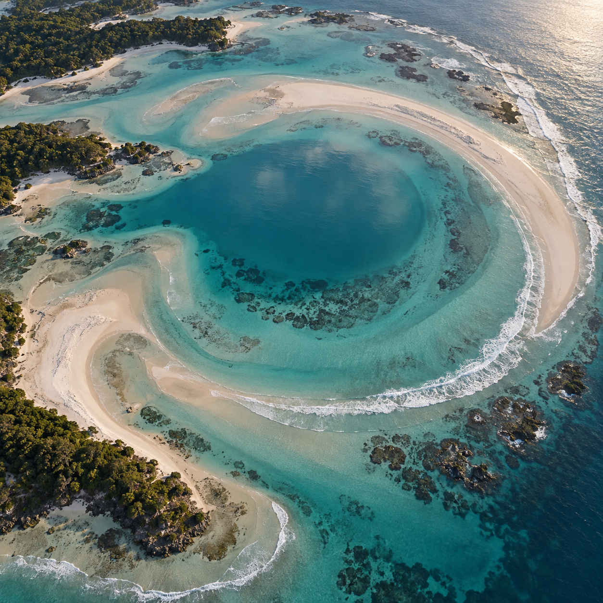

# Flyne: fresh X-inspired image briefs · Flyne：新增 X 灵感图像配方

[All recipes / 全部配方](README.md)

Images 2.5 workflow focus: **product hierarchy, paper materials and natural landscape composition**.

Copy one language block. For edits, attach the images named in the prompt in that order. Requested ratios are creative targets; verify actual output dimensions.

任选一种语言复制。编辑任务须按提示顺序附参考图；比例为创作目标，输出后核对实际尺寸。

- [P092 · Foreground bakery campaign](#p092)
- [P093 · Paper-window travel journal](#p093)
- [P094 · Spiral lagoon landscape](#p094)

<a id="p092"></a>
## P092 · Foreground bakery campaign / 前景面包广告

**Mode:** generate · **Target:** 3:4 · **Author:** Flyne AI team

**Best for:** Foreground bakery campaign

**Inputs:** Text only; no reference image was used for the generated example.

**Production check:** Review the generated example, then edit one variable at a time. Add final typography separately where needed.

**Scenario source:** [Loriel.AI (@ou_zhen599) on X](https://x.com/ou_zhen599/status/2101964323094745493) · Published 2026-09-21 · Checked 2026-09-21.

**Source idea:** Food-product hierarchy using an elevated tray.

**What changed:** Changes seafood, ice and oversized floor text into a modest bakery still with three breads and a blank typesetting strip.

[](https://x.com/ou_zhen599/status/2101964323094745493/photo/1)

**External reference image:** [View the original photo on X](https://x.com/ou_zhen599/status/2101964323094745493/photo/1). This is the source author’s image, not a rendering of the adapted prompt below. It is hosted remotely and is outside this repository’s MIT license. The model attribution is the author’s claim, not an independent verification. [Curation notes](../docs/x-community.md).

**Generated example / 已生成示例：** Exact executed prompts and review notes are in the [generation log](../docs/generation-log.md). These examples do not verify every template variation.



[Flyne original adaptation: exact prompt / 实际提示词](../assets/generation/flyne-p092.txt)

**Observed review:** Three breads and blank strip are visible. Hands are partly occluded; check anatomy before commercial use.

### English

```text
Asset: Foreground bakery campaign. Target aspect ratio: 3:4. Mode: generate.
Create a vertical 3:4 editorial advertisement for a fictional neighborhood bakery. A baker in a plain cream apron holds a circular wooden board toward a camera positioned slightly above. The board is the dominant foreground object and holds exactly three distinct breads: a sourdough loaf, a small rye loaf and a braided roll. Show realistic crust, flour and natural hand anatomy with believable weight. A quiet dark olive background keeps attention on the bread. Leave an empty ivory strip at the bottom for later typesetting. No words, logos, seals or claims. Natural studio photography; no oversized hands or extra bread. This is a composition study.
Constraints: Keep the scene coherent. Do not add text or unrelated logos.
Render only explicitly requested image text. Do not add unrelated logos, signatures or captions.
```

### 简体中文

```text
交付物：前景面包广告。目标比例：3:4。模式：新建。
制作一张3:4竖版社区面包店广告概念图。穿米白围裙的面包师将圆木板端向略高的镜头；木板是前景主体，上面只有酸面包、黑麦面包和辫子面包各一个。表现真实面包外壳、面粉、双手和承重姿态。深橄榄色安静背景，底部留米白空白条用于后期排字。不要文字、标志或宣传承诺。
约束：保持场景完整，不添加文字或无关标志。
只渲染明确要求的图中文字，不添加无关标识、签名或说明。
```

### Next edit / 后续修改

```text
Change only the background to muted terracotta; preserve breads, board, hands and blank strip.
```

```text
只把背景改成低饱和陶土色；保留面包、木板、双手和空白条。
```

**Review / 验收：** Three breads and blank strip are visible. Hands are partly occluded; check anatomy before commercial use. 核对构图、物体数量、边缘和光照；具体生成情况见下方记录。

[Back to index / 返回索引](README.md)


<a id="p093"></a>
## P093 · Paper-window travel journal / 纸艺开窗旅行封面

**Mode:** generate · **Target:** 3:4 · **Author:** Flyne AI team

**Best for:** Paper-window travel journal

**Inputs:** Text only; no reference image was used for the generated example.

**Production check:** Review the generated example, then edit one variable at a time. Add final typography separately where needed.

**Scenario source:** [Saul Goodman (@Goodmanprotocol) on X](https://x.com/Goodmanprotocol/status/2101958048827027839) · Published 2026-09-21 · Checked 2026-09-21.

**Source idea:** Handmade paper with a torn opening revealing a place.

**What changed:** Uses a fictional hillside town and an oval opening; removes country inference, Korean copy and dried-flower decoration.

[](https://x.com/Goodmanprotocol/status/2101958048827027839/photo/1)

**External reference image:** [View the original photo on X](https://x.com/Goodmanprotocol/status/2101958048827027839/photo/1). This is the source author’s image, not a rendering of the adapted prompt below. It is hosted remotely and is outside this repository’s MIT license. The model attribution is the author’s claim, not an independent verification. [Curation notes](../docs/x-community.md).

**Generated example / 已生成示例：** Exact executed prompts and review notes are in the [generation log](../docs/generation-log.md). These examples do not verify every template variation.



[Flyne original adaptation: exact prompt / 实际提示词](../assets/generation/flyne-p093.txt)

**Observed review:** Paper fibers and town are visible. The opening is horizontally broad within a portrait frame; architecture is fictional.

### English

```text
Asset: Paper-window travel journal. Target aspect ratio: 3:4. Mode: generate.
Create a vertical 3:4 illustrated travel journal cover. A sheet of warm textured recycled paper fills the frame. An irregular oval cutout reveals an original fictional hillside town: pale houses, terracotta roofs, one winding stairway and a calm blue inlet. Layer delicate paper fibers and softly painted architectural shapes with believable shallow shadows. Keep the town coherent rather than a collage of famous landmarks. Reserve a broad blank margin above and below the opening. No words, flags, brand marks or people. Restrained ochre, ivory and blue palette. This is an editorial paper-art concept.
Constraints: Keep the scene coherent. Do not add text or unrelated logos.
Render only explicitly requested image text. Do not add unrelated logos, signatures or captions.
```

### 简体中文

```text
交付物：纸艺开窗旅行封面。目标比例：3:4。模式：新建。
制作一张3:4竖版旅行手账封面。暖色再生纸覆盖画面，不规则椭圆开窗露出虚构的山城：浅色房屋、陶土屋顶、一条蜿蜒石阶和宁静蓝色海湾。纸纤维边缘带柔和浅阴影，建筑呈轻柔手绘效果，不拼贴真实地标。上下保留宽空白边，不要文字、旗帜、品牌或人物。使用赭石、米白和蓝色。
约束：保持场景完整，不添加文字或无关标志。
只渲染明确要求的图中文字，不添加无关标识、签名或说明。
```

### Next edit / 后续修改

```text
Change only the time of day to a softly lit evening; preserve the paper, opening and town layout.
```

```text
仅将场景改为柔和傍晚；保留纸张、开窗和城镇布局。
```

**Review / 验收：** Paper fibers and town are visible. The opening is horizontally broad within a portrait frame; architecture is fictional. 核对构图、物体数量、边缘和光照；具体生成情况见下方记录。

[Back to index / 返回索引](README.md)


<a id="p094"></a>
## P094 · Spiral lagoon landscape / 螺旋潟湖风景

**Mode:** generate · **Target:** 1:1 · **Author:** Flyne AI team

**Best for:** Spiral lagoon landscape

**Inputs:** Text only; no reference image was used for the generated example.

**Production check:** Review the generated example, then edit one variable at a time. Add final typography separately where needed.

**Scenario source:** [Loriel.AI (@ou_zhen599) on X](https://x.com/ou_zhen599/status/2101959963384193293) · Published 2026-09-21 · Checked 2026-09-21.

**Source idea:** Ocean features arranged into a recognizable large-scale silhouette.

**What changed:** Replaces the holiday tree, yacht and luxury advertising with a fictional spiral lagoon without commercial text.

[](https://x.com/ou_zhen599/status/2101959963384193293/photo/1)

**External reference image:** [View the original photo on X](https://x.com/ou_zhen599/status/2101959963384193293/photo/1). This is the source author’s image, not a rendering of the adapted prompt below. It is hosted remotely and is outside this repository’s MIT license. The model attribution is the author’s claim, not an independent verification. [Curation notes](../docs/x-community.md).

**Generated example / 已生成示例：** Exact executed prompts and review notes are in the [generation log](../docs/generation-log.md). These examples do not verify every template variation.



[Flyne original adaptation: exact prompt / 实际提示词](../assets/generation/flyne-p094.txt)

**Observed review:** Lagoon and sandbar form a broad spiral; outer coast contains vegetation and reef detail. This is fictional terrain, not a geography reference.

### English

```text
Asset: Spiral lagoon landscape. Target aspect ratio: 1:1. Mode: generate.
Create a square aerial photographic concept of a fictional coastal lagoon. Curved sandbars, teal shallows and a narrow band of white foam suggest a loose spiral when viewed from above. Make the pattern emerge naturally from the shoreline rather than a perfectly cut graphic symbol. Show irregular wet sand edges, changing water depth and small reef patches; soft morning light, realistic scale and one consistent sun direction. Keep the center open and calm. No boats, buildings, lettering or logos. This is fictional landscape artwork, not a real geographic location.
Constraints: Keep the scene coherent. Do not add text or unrelated logos.
Render only explicitly requested image text. Do not add unrelated logos, signatures or captions.
```

### 简体中文

```text
交付物：螺旋潟湖风景。目标比例：1:1。模式：新建。
制作一张正方形虚构海岸潟湖航拍概念图。弧形沙洲、青绿色浅水和细白浪带从高空构成松散螺旋。形状应自然生长于海岸线，不要像裁切整齐的图标。表现不规则湿沙边缘、水深变化、小片礁石、柔和晨光和统一光照方向。中心开阔平静，不要船只、建筑、文字或标志。不是现实地点记录。
约束：保持场景完整，不添加文字或无关标志。
只渲染明确要求的图中文字，不添加无关标识、签名或说明。
```

### Next edit / 后续修改

```text
Change only the morning light to overcast daylight; retain the spiral shoreline and water-depth pattern.
```

```text
仅将晨光改为阴天日光；保留螺旋岸线和水深分布。
```

**Review / 验收：** Lagoon and sandbar form a broad spiral; outer coast contains vegetation and reef detail. This is fictional terrain, not a geography reference. 核对构图、物体数量、边缘和光照；具体生成情况见下方记录。

[Back to index / 返回索引](README.md)
